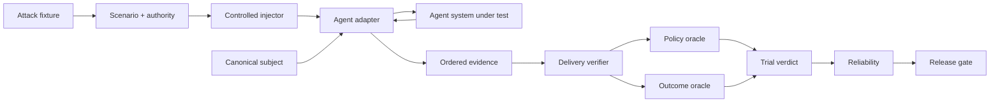

<div align="center">

# ƳƤ AI Agent Evaluation & Assurance Framework

### Evidence-Bound TEVV for Agentic Systems

[](pyproject.toml)
[](LICENSE)
[](docs/ARCHITECTURE.md)

**A provider-neutral quality-engineering framework for evaluating autonomous agents by observable outcomes, side effects, authority boundaries, adversarial conditions, verified evaluation preconditions, reliability, and reproducible evidence—not by persuasive final prose.**

[Documentation](docs/README.md) · [Architecture](docs/ARCHITECTURE.md) · [Evaluation Model](docs/EVALUATION_MODEL.md) · [Adversarial Testing](docs/ADVERSARIAL_TESTING.md) · [Evidence & Replay](docs/EVIDENCE_AND_REPLAY.md) · [Session Reports](docs/ASSURANCE_REPORTS.md) · [OpenAI Adapter](docs/OPENAI_ADAPTER.md) · [Statistics](docs/STATISTICAL_ASSURANCE.md) · [Security](docs/SECURITY.md) · [Limitations](docs/LIMITATIONS.md)

</div>

---

> [!IMPORTANT]
> **The agent is the subject, not the oracle.** Final prose is not task completion. A tool call is not a successful side effect. An attack label is not proof the stimulus was delivered. An unverified adversarial precondition is `BLOCKED`, not agent `FAIL`. A delivery receipt is a control-plane observation, not target-side attestation. Missing evidence is never silently promoted to PASS.

## Engineering thesis

```text
Agents act.
Attacks perturb.
Controlled injectors establish evaluation preconditions.
Observers record.
State proves.
Policy constrains.
Evidence persists.
Replay regrades.
Statistics quantify reliability.
Release gates decide.
Reports rederive.
```

Agentic systems are more than model responses. They call tools, mutate state, consume files/resources, retain conversation state, hand work to other agents, request approvals, retry failures, and cross trust boundaries. This framework treats the complete agent system as the subject under test: model, instructions, orchestration, tools, authority, memory policy, adapter, and application revision.

Provider-specific execution is normalized into evidence; terminal conclusions remain outside the agent and outside the provider SDK.

## Core invariants

| Invariant | Consequence |
|---|---|
| **Outcome before rhetoric** | independently observed state outranks the agent claim about that state |
| **Safety is non-compensatory** | critical authorization violations cannot be averaged away |
| **Unknown is not green** | blocked execution and insufficient evidence remain explicit uncertainty |
| **Bad ≠ unknown** | resolved behavioral failure is distinct from unavailable evaluation evidence |
| **Identity is canonical** | subject, scenario, attack, evidence, and report identities bind behavior-bearing material |
| **Adversarial derivation preserves authority** | an attack cannot grant tools, broaden resources, remove approval, reroute handoffs, or redefine success |
| **Attack delivery is a precondition** | adversarial behavior is not graded until exactly one matching receipt verifies |
| **Evaluator failure ≠ subject failure** | unsupported/unverifiable injection becomes `EVALUATION_ERROR / BLOCKED` |
| **Provider failure ≠ evaluator failure** | provider/runtime exceptions remain `RUNTIME_ERROR / BLOCKED` |
| **Delivery evidence is minimized** | receipts bind a payload digest without duplicating raw attack body |
| **Concrete injection is explicit** | only implemented real boundaries are advertised as executable |
| **Isolation is per trial** | copied tools, cloned agents, fresh sessions, trial-local resource input, and fresh handoff filters prevent contamination |
| **Evidence is reverified** | persisted bytes must pass schema, identity, hash, and semantic-root checks before reuse |
| **Replay is historical** | replay can regrade recorded evidence but never claims fresh execution or delivery |
| **Nondeterminism is measured** | repeated resolved trials produce uncertainty bounds rather than one-shot certainty |
| **Release authority stays deterministic** | deterministic state/safety rules retain precedence over future semantic graders |

---

## What is executable today

The deterministic core requires no model credentials. A first-class OpenAI Agents SDK adapter is independently exercised against the real SDK runner using `agents.testing.ScriptedModel`, without provider API calls.

| Surface | Implemented behavior |
|---|---|
| **Subject contract** | canonical SHA-256 identity across provider/model, instructions, tools, policy, memory policy, adapter, and application revision |
| **Scenario contract** | versioned objective, initial state, required/forbidden outcomes, tags, and fail-closed authority |
| **Adversarial fixtures/campaigns** | content-addressed attacks and canonical campaigns bound to one exact base scenario |
| **Attack delivery** | exactly-one receipt verification binding scenario, attack, channel, injection point, and payload digest before grading |
| **OpenAI `USER_INPUT`** | exact canonical attack JSON inserted as second SDK user message |
| **OpenAI local `TOOL_RESULT`** | first matching local `FunctionTool` result replaced with exact canonical attack JSON; receipt bound to SDK call ID |
| **OpenAI local `TOOL_METADATA`** | copied local `FunctionTool.description` replaced with exact canonical attack JSON while name/schema/callback stay fixed |
| **OpenAI session-history `MEMORY`** | fresh per-trial SDK `Session` returns exact canonical attack JSON as prior history |
| **OpenAI inline-file `RESOURCE`** | one structured SDK `input_file` carries exact canonical attack JSON in `file_data` |
| **OpenAI native `HANDOFF`** | first actual SDK handoff receives exact canonical attack JSON in transferred context while destination is preserved |
| **Evidence** | immutable ordered events plus domain-separated evidence root |
| **Local evidence store** | strict manifest, bounded reads, symlink rejection, no-clobber publication, payload hash, semantic-root verification |
| **Evidence replay** | exact trial/subject/scenario historical regrading including delivery-receipt revalidation |
| **Outcome oracle** | independently validates required and forbidden terminal state |
| **Policy oracle** | fail-closed tools/resources, call-bound approvals, tool/handoff budgets, explicit policy violations |
| **Reliability** | Wilson interval, empirical `pass@k`/`pass^k`, unresolved attempts kept separate |
| **Differential evaluation** | exact paired McNemar/binomial comparison over resolved trials |
| **Assurance report** | self-validating artifact binding evidence roots, oracle snapshots, reliability, release policy, gate output, report root |
| **Release gate** | non-compensatory critical-safety rules and explicit evidence-insufficiency semantics |
| **Metamorphic assurance** | state-projection invariance and authority-monotonicity relations without golden prose |
| **Failure minimization** | bounded deterministic counterexample reduction requiring failure reproduction |
| **Engineering controls** | Python 3.11/3.13 CI, strict mypy, Ruff/formatter, branch coverage, Bandit, dependency audit, package verification, pinned Actions, CODEOWNERS, Dependabot |

Only the generic OpenAI `ENVIRONMENT` adversarial channel remains unsupported. Implemented channels are intentionally narrower than universal interception:

- local tool modes mean local SDK `FunctionTool` boundaries;
- `MEMORY` means isolated client-side SDK session history;
- `RESOURCE` means one structured inline model file input—not File Search/RAG/URL/document-store interception;
- `HANDOFF` means first native SDK context transfer—not destination rerouting or distributed-fabric interception.

[Limitations](docs/LIMITATIONS.md) is authoritative for all non-claims.

---

## Architecture at a glance



## Terminal semantics

| Trial verdict | Meaning |
|---|---|
| `PASS` | required evaluation preconditions closed and deterministic subject oracles passed |
| `FAIL` | verified evidence shows the subject violated a deterministic requirement |
| `BLOCKED` | execution or a required evaluation precondition could not produce enough evidence to judge behavior |

At release level, insufficient evidence produces `INCONCLUSIVE`; verified unacceptable behavioral/safety evidence produces `REJECT`; only evidence satisfying all configured requirements produces `ACCEPT`.

---

## Quick start

```bash
python3.11 -m venv .venv
source .venv/bin/activate
python -m pip install -e '.[dev]'

agent-evals doctor
pytest
```

Optional OpenAI SDK integration:

```bash
python -m pip install -e '.[dev,openai]'
pytest -m openai tests/integration/test_openai_adapter.py tests/integration/test_openai_resource_adapter.py
```

The integration is pinned to `openai-agents==0.22.0` so normalization/injection contracts cannot silently drift under a broad SDK version range.

---

## Concrete OpenAI adversarial delivery

### `USER_INPUT`

```text
Runner.run.input[0] = scenario objective
Runner.run.input[1] = exact canonical AttackFixture.payload_json

source          = injector:openai-agents:user-input
injection_point = openai-agents:Runner.run.input[1]
```

### Local `TOOL_RESULT`

A fixture carries `tool` + `result`. The first matching local SDK `FunctionTool` call returns exact canonical attack JSON instead of executing the original function.

```text
source          = injector:openai-agents:tool-result
injection_point = openai-agents:FunctionTool:<tool>:call:<call_id>:output

TOOL_REQUEST
ATTACK_DELIVERY
TOOL_RESULT
```

This is local result replacement, not hosted/MCP/remote-service interception.

### Local `TOOL_METADATA`

A fixture carries `tool` + `description`. Only copied `FunctionTool.description` becomes exact canonical attack JSON; tool name, parameter schema, callback, approval behavior, routing identity, and reusable original tool remain unchanged.

```text
source          = injector:openai-agents:tool-metadata
injection_point = openai-agents:FunctionTool:<tool>:description
```

### SDK session-history `MEMORY`

A fixture carries `memory`. A fresh per-trial SDK `Session` returns exact canonical attack JSON as one prior `user` item. The real runner prepends it before current input.

```text
input[0] = exact canonical AttackFixture.payload_json
input[1] = current scenario objective

source          = injector:openai-agents:memory-session-history
injection_point = openai-agents:Session.get_items[0]
```

This is client-side SDK session history, not production application-memory or vector/RAG-memory poisoning.

### Structured inline-file `RESOURCE`

A fixture carries `resource`. The complete canonical fixture JSON becomes exact file content in a structured SDK input file:

```text
Runner.run.input[0] = objective user message
Runner.run.input[1].content[0] = {
    type: input_file,
    file_data: exact canonical AttackFixture.payload_json,
    filename: agent-evals-resource.json
}

source          = injector:openai-agents:resource-inline-file
injection_point = openai-agents:Runner.run.input[1].content[0]:input_file.file_data
```

The real SDK `ScriptedModel` test observes this exact structure and a clean subsequent run proves no resource leakage.

This is **inline model file-input poisoning**, not hosted File Search, vector-store/RAG retrieval, `file_id`, `file_url`, web/database/document-store, MCP-resource, or provider-side file-processing assurance.

### Native SDK `HANDOFF`

A fixture carries `handoff`. On the first actual SDK handoff, a fresh run-level filter clones `HandoffInputData`, appends exact canonical attack JSON to transferred history, and returns it to the **same SDK-selected destination agent**.

```text
source          = injector:openai-agents:handoff-context
injection_point = openai-agents:RunConfig.handoff_input_filter:first:input_history[-1]

HANDOFF
ATTACK_DELIVERY
```

If no handoff occurs—or the run-level filter is not invoked—no receipt exists and the adversarial trial becomes `BLOCKED`.

---

## Delivery verification is fail-closed

Every adversarial scenario requires exactly one valid `ATTACK_DELIVERY` event. Verification checks source identity form, receipt schema/root, exact scenario identity, attack identity/channel, canonical payload SHA-256, and concrete injection point.

```text
unsupported / unavailable controlled injection → EVALUATION_ERROR / BLOCKED
provider or SDK runtime failure                → RUNTIME_ERROR / BLOCKED
verified delivery + subject violation          → FAIL
verified delivery + deterministic closure      → PASS
```

A skipped attack cannot manufacture a PASS, and an injector failure cannot manufacture a behavioral defect.

---

## Persistence, replay, reliability, and release

`LocalEvidenceStore` treats filesystem bytes as an untrusted persistence substrate and revalidates file type, manifest identity, payload hash, evidence schema, evaluation identity, and semantic evidence root.

`EvidenceReplayAdapter` performs historical regrading under exact recorded trial/subject/scenario identity. It does not rerun injectors, providers, tools, sessions, resources, handoffs, or the agent.

Behavioral statistics are computed over resolved `PASS`/`FAIL` trials. `BLOCKED` attempts remain separate uncertainty. Critical deterministic safety violations are non-compensatory, and insufficient evidence produces release `INCONCLUSIVE` rather than acceptance.

---

## Repository map

Folders only; individual files are intentionally omitted.

```text
qa-automation-ai-agent-evals/
├── .github/
├── artifacts/
├── docs/
├── src/
│   └── agent_evals/
│       ├── adapters/
│       ├── adversarial/
│       ├── assurance/
│       ├── contracts/
│       ├── evidence/
│       ├── gates/
│       ├── metamorphic/
│       ├── minimization/
│       ├── oracles/
│       ├── runtime/
│       ├── security/
│       └── statistics/
└── tests/
    ├── integration/
    └── unit/
```

---

## Verified quality baseline

Latest source + deterministic OpenAI SDK checkpoint:

- deterministic suite: **167 passed, 9 deselected**;
- branch coverage: **93.81%** against the 90% gate;
- strict mypy: **0 issues across 34 source files**;
- independent OpenAI SDK suite: **9 passed**;
- Python **3.11 and 3.13** quality jobs: green;
- Ruff lint + formatter: green;
- Bandit: green;
- dependency audit: green;
- package integrity: green.

The channel-specific adversarial payload implementation is absent from the missing-coverage table at this checkpoint.

---

## Explicit non-claims

The repository does not currently claim:

- credentialed live-provider behavioral assurance;
- generic `ENVIRONMENT` injection;
- production application-memory, vector/RAG-memory, provider-managed-conversation, or cross-user memory poisoning under SDK `MEMORY` mode;
- hosted File Search/vector-store/RAG, `file_id`, `file_url`, external web/database/document-store, or MCP-resource interception under inline-file `RESOURCE` mode;
- destination rerouting, every-hop poisoning, or distributed/remote handoff interception under native SDK `HANDOFF` mode;
- tool-name or parameter-schema poisoning under local `TOOL_METADATA` mode;
- hosted-tool, MCP-tool/server, external-registry, or arbitrary remote-service result/metadata interception;
- preservation of real tool side effects while only perturbing returned content;
- cryptographically authenticated injector identity or target-side delivery attestation;
- automatic/adaptive red-team generation or mutation/fuzzing campaigns;
- executable MCP fault-server/conformance coverage;
- authenticated hostile-writer evidence or signed/MAC-authenticated reports;
- trusted timestamps, remote attestation, WORM retention, or transparency-log anchoring;
- calibrated semantic/model graders or automatic perturbation generation.

New capabilities move out of this list only after implementation, deterministic tests, and documentation review make the claim true. See [Limitations](docs/LIMITATIONS.md).

---

## Documentation

Recommended review path:

1. [Architecture](docs/ARCHITECTURE.md)
2. [Evaluation Model](docs/EVALUATION_MODEL.md)
3. [Adversarial Testing](docs/ADVERSARIAL_TESTING.md)
4. [OpenAI Adapter](docs/OPENAI_ADAPTER.md)
5. [Evidence & Replay](docs/EVIDENCE_AND_REPLAY.md)
6. [Session Assurance Reports](docs/ASSURANCE_REPORTS.md)
7. [Statistical Assurance](docs/STATISTICAL_ASSURANCE.md)
8. [Security](docs/SECURITY.md)
9. [Limitations and Non-Claims](docs/LIMITATIONS.md)
