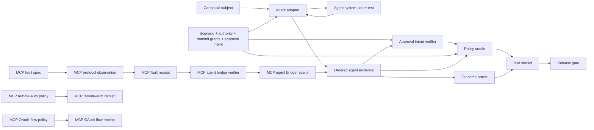

<div align="center">

# ƳƤ AI Agent Evaluation & Assurance Framework

### Evidence-Bound TEVV for Agentic Systems

[](pyproject.toml)
[](LICENSE)
[](docs/ARCHITECTURE.md)

**A provider-neutral quality-engineering framework for evaluating autonomous agents by observable outcomes, side effects, authority boundaries, approval intent, adversarial conditions, verified evaluation preconditions, protocol state, authorization behavior, reliability, and reproducible evidence—not by persuasive final prose.**

[Documentation](docs/README.md) · [Architecture](docs/ARCHITECTURE.md) · [Evaluation Model](docs/EVALUATION_MODEL.md) · [Semantic Judging](docs/SEMANTIC_JUDGING.md) · [Handoff Authority](docs/HANDOFF_AUTHORITY.md) · [HITL Approval](docs/APPROVAL_INTENT.md) · [Adversarial Testing](docs/ADVERSARIAL_TESTING.md) · [MCP Fault Lab](docs/MCP_LAB.md) · [MCP Remote Auth](docs/MCP_REMOTE_AUTH.md) · [MCP OAuth Flow](docs/MCP_OAUTH_FLOW.md) · [Evidence & Replay](docs/EVIDENCE_AND_REPLAY.md) · [Session Reports](docs/ASSURANCE_REPORTS.md) · [OpenAI Adapter](docs/OPENAI_ADAPTER.md) · [Statistics](docs/STATISTICAL_ASSURANCE.md) · [Security](docs/SECURITY.md) · [Limitations](docs/LIMITATIONS.md)

</div>

---

> [!IMPORTANT]
> **The agent is the subject, not the oracle.** Final prose is not task completion. A tool call is not a successful side effect. An approval request is not an approval grant, and an approval receipt is not human identity or production authorization. A handoff observation is not delegated authority. A raw handoff count is not an accepted authority epoch. An attack label is not proof of delivery. A configured environment value is not proof of consumption. Cached MCP discovery is not current server truth. A raw MCP receipt is not proof that an agent consumed the condition. A semantic PASS is not proof of external state, authorization, or safety. A bearer challenge is not proof of correct issuer policy. Resource-server success is not OAuth-flow correctness. OAuth-flow success is not agent correctness. Missing or invalid evidence is never silently promoted to PASS.

## Engineering thesis

```text
Agents act.
Approvals interrupt.
Delegation changes authority.
Attacks perturb.
Protocols carry untrusted content and state.
Authorization constrains access.
Controlled injectors establish evaluation preconditions.
Observers record.
Receipts bind exact relations; they do not create external trust.
State proves.
Policy constrains.
Evidence persists.
Replay regrades.
Calibrated semantic judges may narrow deterministic success; they never override deterministic failure.
Statistics quantify reliability.
Release gates decide.
Reports rederive.
```

Agentic systems call tools, mutate state, consume resources, retain session history, transfer work across agents, read runtime dependencies, interact with protocol servers, cross authorization boundaries, request approvals, retry failures, and operate nondeterministically. Evaluating only a final message cannot distinguish completed work from a plausible claim that work occurred.

This framework treats the **complete agent system** as the subject under test: model, instructions, orchestration, tools, authority, approval policy, memory policy, adapter, and application revision. Provider-specific execution becomes normalized evidence; deterministic state, policy, protocol observations, approval verification, and release authority remain outside the agent and outside model confidence.

## Core invariants

| Invariant | Consequence |
|---|---|
| **Outcome before rhetoric** | independently observed state outranks the agent's claim about state |
| **Safety is non-compensatory** | a critical authorization violation cannot be averaged away |
| **Unknown is not green** | blocked execution and missing evidence remain explicit uncertainty |
| **Bad ≠ unknown** | resolved subject failure is distinct from evaluator/runtime inability to judge |
| **Identity is canonical** | subject, scenario, attack, approval intent, MCP fault, resource-server auth policy, OAuth-flow policy, evidence, and report identities bind behavior-bearing material |
| **Approval request ≠ execution** | a pending native approval interruption is `APPROVAL_REQUEST`; executable `TOOL_REQUEST` exists only if the resumed run actually reaches the tool |
| **Approval receipt ≠ human authentication** | `ApprovalIntentReceipt` binds one evaluator-owned decision to one exact invocation relation; it does not prove human identity, presence, or enterprise authorization |
| **Legacy approval ≠ stronger HITL intent** | call-scoped or persistent `APPROVAL` evidence cannot substitute for `APPROVAL_DECISION` when `ApprovalIntentSpec` is configured |
| **Handoff ≠ delegation** | an observed source→target transfer is authorized only by an exact scenario-owned grant and sufficient run-item provenance |
| **Accepted epoch ≠ handoff count** | malformed, unauthorized, wrong-source, or re-expanding handoffs do not advance active authority, approval epoch, or path identity |
| **Same depth ≠ same authority path** | approvals bind a domain-separated accepted-path hash so sibling paths at the same epoch cannot replay one another's decision |
| **Delegation never expands** | effective tools, resource prefixes, inherited approval requirements, and delegated budgets may preserve or narrow across a valid handoff path, never broaden |
| **Adversarial derivation preserves authority** | an attack cannot grant tools, broaden resources, remove approval, reroute handoffs, or redefine success |
| **Attack delivery is a precondition** | adversarial behavior is graded only after one exact matching receipt verifies |
| **Availability ≠ consumption** | an environment value that subject code never reads is not a delivered attack |
| **MCP configuration ≠ observation** | an MCP fault exists as protocol evidence only after the official client observes the required representation or relation |
| **Cached discovery ≠ server truth** | a still-fresh `tools/list` result does not prove the current server schema or registry identity |
| **Discovery ≠ call validation** | server-side `tools/call` validity is independently observed rather than inferred from cached metadata |
| **Raw protocol receipt ≠ agent behavior** | `MCPFaultReceipt` alone does not establish agent consumption, resistance, or correctness |
| **Retry label ≠ causal retry** | a second identical tool call is credited as recovery only when evidence orders the first result before the second request |
| **Bridge closure ≠ grading authority** | a verified MCP→agent bridge establishes a delivery precondition; deterministic subject oracles still decide PASS/FAIL |
| **Bearer authentication ≠ issuer/resource policy** | SDK bearer handling and verifier-owned identity/resource binding are credited to their actual enforcement components |
| **Resource-server success ≠ OAuth-flow correctness** | a 401/403/authorized-call matrix does not prove registration, PKCE, issuance, or introspection |
| **OAuth-flow success ≠ agent correctness** | a valid OAuth path proves protocol/control-plane behavior, not safe or correct agent behavior |
| **Evaluator failure ≠ subject failure** | unavailable/unverifiable controlled delivery, approval relation, or provenance becomes `EVALUATION_ERROR / BLOCKED` |
| **Provider failure ≠ evaluator failure** | provider/runtime exceptions remain `RUNTIME_ERROR / BLOCKED` |
| **Evidence is reverified** | persisted bytes must pass schema, identity, hash, semantic-root, and scenario-required receipt checks before reuse |
| **Replay is historical** | replay regrades recorded evidence; persisted semantic receipts are revalidated without a fresh model call, and replay does not pretend to re-execute the subject, approval interruption, or human review |
| **Semantic judgment is subordinate** | deterministic policy/outcome failure short-circuits semantic invocation; semantic PASS cannot rescue it, semantic FAIL is non-critical, and ABSTAIN remains `INCONCLUSIVE` |
| **Calibration is identity-bound** | judge prompt/model/configuration drift invalidates calibration reuse; aggregate accuracy cannot substitute for false-PASS, abstention, judge-failure, and adversarial-coverage gates |
| **Nondeterminism is measured** | repeated trials produce uncertainty bounds instead of one-shot certainty |
| **Release authority is deterministic** | critical state/safety evidence cannot be overridden by future semantic graders |

---

## What is executable today

The deterministic core requires no model credentials. The executable surface is intentionally separated into four lanes so one green boundary cannot silently upgrade another:

1. **Provider-neutral core** — contracts, evidence, persistence, replay, deterministic oracles, calibrated subordinate semantic-judging contracts, statistics, metamorphic assurance, reporting, minimization, and release gates, including scenario-owned directed handoff grants, exact accepted authority-path state, scenario-bound optional approval intent, and optional content-addressed semantic rubrics.
2. **OpenAI Agents SDK tier** — the real SDK runner exercised with `agents.testing.ScriptedModel`, with no provider API call, across seven scoped local/SDK adversarial channels, native handoff-authority attenuation, an exact native HITL `ToolApprovalItem` → same-`RunState` approve/reject continuation path, and a one-turn no-tools semantic judge over the same public SDK model boundary.
3. **MCP protocol/control-plane laboratories** — the six-fault official-client protocol lab, real loopback resource-server authorization lab, and separated two-origin OAuth authorization-code/PKCE/introspection lab.
4. **OpenAI↔MCP delivery bridges** — four deliberately narrow official-stdio paths: one `TOOL_METADATA_POISON` discovery → exact model-visible tool-definition bridge, one `TOOL_RESULT_POISON` result bridge, one causal `TOOL_ERROR` → same-argument retry → benign recovery bridge, and one host-refreshed `TOOL_SCHEMA_DRIFT` v1-rejection → refreshed-v2 → corrected-call bridge. Each has its own integrity-bound receipt and ordered `PROTOCOL_DELIVERY` evidence. Metadata delivery closes at the first verified model-visible target definition and does not require a target tool call.

Handoff authority, native HITL approval, and MCP bridges solve different trust problems. Handoff authority remains scenario-owned authorization over normalized subject evidence. Native HITL introduces a dedicated evaluator-owned receipt because a decision must bind one exact pending interruption to its continuation. MCP bridges cross protocol and agent evidence domains and therefore require their own dedicated bridge receipts.

The stronger HITL path does **not** claim authenticated humans, enterprise workflow attestation, production IAM, hosted approval UI correctness, or distributed resume safety. The MCP bridges are likewise not a blanket promotion of the MCP laboratories: `TOOL_METADATA_POISON` now has a narrow model-visible delivery bridge, but that receipt does not prove model attention, interpretation, compliance, resistance, or safe behavior; stale-cache and identity-drift remain protocol-only with respect to agent behavior, and remote-auth/OAuth receipts remain separate control-plane evidence.

### Evaluation and assurance core

| Surface | Implemented behavior |
|---|---|
| **Subject contract** | canonical SHA-256 identity across provider/model, instructions, tools, policy, memory policy, adapter, and application revision |
| **Scenario contract** | versioned objective, initial state, required/forbidden outcomes, classification, tags, fail-closed authority, exact optional root agent, canonical directed handoff grants, optional exact `ApprovalIntentSpec`, and optional content-addressed `SemanticRubricSpec`; all behavior-bearing material participates in scenario identity |
| **Adversarial fixtures/campaigns** | content-addressed attacks and canonical campaigns bound to one exact base scenario |
| **Attack delivery** | exactly-one receipt verification binding scenario, attack, channel, injection point, and payload digest before adversarial grading |
| **Approval intent** | exact native request→decision→continuation verification binding agent, tool, call ID, canonical finite-JSON arguments, exact resource, accepted authority epoch/path, and scenario identity |
| **Evidence** | immutable ordered events plus a domain-separated evidence root |
| **Local evidence store** | strict manifest, bounded reads, symlink rejection, no-clobber publication, payload hash, semantic-root verification |
| **Replay** | exact trial/subject/scenario historical regrading including delivery-receipt, approval-intent, handoff-authority, and persisted semantic-judgment revalidation; replay never silently calls a fresh semantic model |
| **Outcome oracle** | independently validates required and forbidden terminal state |
| **Policy oracle** | fail-closed tools/resources, legacy call/persistent approvals, stronger native approval decisions, approval-request authority, global budgets, active-agent chronology, directed handoff grants, path-local attenuation, delegated per-agent budgets, and explicit policy violations |
| **Reliability** | resolved success rate, Wilson interval, empirical `pass@k`/`pass^k`; unresolved attempts stay separate |
| **Differential evaluation** | exact paired McNemar/binomial comparison over resolved trials |
| **Semantic judging** | optional scenario-owned rubric, exact judge-profile/calibration authority, bounded PASS/FAIL/ABSTAIN response, terminal non-critical receipt bound to the pre-semantic evidence root, and deterministic short-circuit precedence |
| **Assurance reports** | v2 self-validating artifacts keeping deterministic oracle snapshots and optional semantic receipts as separate authority classes while rederiving trial verdicts, reliability, release policy, gate result, and report root |
| **Release gate** | non-compensatory critical-safety rules plus explicit `ACCEPT`, `REJECT`, and `INCONCLUSIVE` semantics |
| **Metamorphic assurance** | state-projection invariance and authority-monotonicity relations without golden prose |
| **Failure minimization** | bounded deterministic counterexample reduction requiring failure reproduction |

### Seven scoped OpenAI adversarial channels

`OpenAIAgentsAdapter` implements every generic `AttackChannel` category at a narrow tested SDK/local boundary:

| Channel | Concrete implementation |
|---|---|
| **`USER_INPUT`** | exact canonical attack JSON as the second ordered `Runner.run` user message |
| **local `TOOL_RESULT`** | first matching local `FunctionTool` result replaced with exact canonical attack JSON; receipt bound to SDK call ID |
| **local `TOOL_METADATA`** | copied local `FunctionTool.description` replaced with exact canonical attack JSON while name/schema/callback remain fixed |
| **session-history `MEMORY`** | fresh per-trial SDK `Session` returns exact canonical attack JSON as prior history |
| **inline-file `RESOURCE`** | structured SDK `input_file.file_data` contains exact canonical attack JSON |
| **native `HANDOFF`** | first actual SDK handoff receives exact canonical attack JSON in transferred context while destination is preserved |
| **runtime-context `ENVIRONMENT`** | first matching local tool sees exact canonical attack JSON for one targeted `RunContextWrapper.context` key; receipt exists only after actual value consumption |

Seven generic channels implemented does **not** mean universal production interception. [Limitations](docs/LIMITATIONS.md) is authoritative.

### Native OpenAI handoff authority attenuation

`OpenAIAgentsHandoffAuthorityAdapter` is a separate, stronger contract for native multi-agent routing. It does not replace the generic `HANDOFF` adversarial channel.

```text
exact scenario root_agent
        == pre-execution ==
supplied SDK Agent.name
        ↓
HANDOFF(source_agent → target_agent)
        ↓ exact directed grant
path-local authority may only narrow
        ↓
SDK-attributed TOOL_REQUEST / TOOL_RESULT / APPROVAL_REQUEST
        ↓ request/result call-owner consistency
PolicyOracle checks active agent + delegated authority
```

The scenario graph is canonical and content-addressed as part of `EvaluationScenario.identity`. Every runtime transition must match one exact grant. A child may retain only a subset of the source tools, resource prefixes must remain inside the source scope, inherited approval requirements on retained tools cannot be removed, and delegated tool/handoff budgets cannot increase. A later hop cannot regain authority lost earlier merely because that authority was legal for the root.

The adapter uses public pinned-SDK run-item agent names as **run-local provenance**, not as cryptographic or globally unique principals. Root mismatch, missing/ambiguous agent identity, or request/result owner disagreement is evaluator uncertainty and becomes `EVALUATION_ERROR / BLOCKED`. Once provenance is sufficient, unauthorized transitions or delegated actions become critical deterministic `PolicyOracle` failures. See [Native Handoff Authority](docs/HANDOFF_AUTHORITY.md).

### Native OpenAI HITL approval-intent binding

`OpenAIAgentsHITLApprovalAdapter` closes one deliberately narrow native approval relation through the real pinned SDK:

```text
ApprovalIntentSpec(agent, tool, approve|reject)
        ↓
native ToolApprovalItem
        ↓
APPROVAL_REQUEST
  exact SDK generating agent
  exact tool + stable call ID
  canonical finite-JSON argument digest
  exact normalized resource when scoped
  accepted authority epoch + path hash
        ↓
ApprovalIntentReceipt / APPROVAL_DECISION
        ↓ same RunState
state.approve(...) or state.reject(...)
        ↓
Runner.run(..., state=same_run_state)
        ↓
approve: matching TOOL_REQUEST → TOOL_RESULT exactly once
reject: explicit rejection TOOL_RESULT; protected TOOL_REQUEST absent
        ↓
verify_approval_intent(...)
        ↓
deterministic policy/outcome oracles
```

The approval receipt binds scenario identity, decision, run-local agent, tool, call ID, canonical arguments, exact resource, **accepted** handoff epoch, and a domain-separated hash of the exact accepted handoff path. Malformed or unauthorized handoff-shaped evidence cannot advance that state, and two sibling paths at equal depth cannot replay one another's receipt.

Canonical argument identity rejects duplicate JSON keys and non-finite/overflow numeric values. A clean rejection requires explicit post-decision continuation evidence. If a rejected invocation nevertheless reaches executable `TOOL_REQUEST`, the verifier preserves that resolved chronology so `PolicyOracle` grades execution-after-rejection as critical `FAIL` rather than masking it as `BLOCKED`.

Legacy call-scoped and persistent `APPROVAL` evidence remains supported for legacy scenarios but cannot satisfy or override an `ApprovalIntentSpec`. This boundary proves an evaluator-owned relation inside `openai-agents==0.22.0`; it does not prove real-human identity, signatures, enterprise approval workflow correctness, production IAM, provider-side authorization, hosted UI correctness, or distributed resume safety. See [Native HITL Approval Intent](docs/APPROVAL_INTENT.md).

### Deterministic MCP protocol fault laboratory

`MCPFaultLab` uses official `mcp==2.1.1` and protocol revision `2026-07-28`. Each probe builds a fresh real `MCPServer`, connects an official `Client`, and emits `MCPFaultReceipt` only after the complete fault-specific public-client observation contract is satisfied.

| Fault | Verified protocol boundary |
|---|---|
| **tool metadata poison** | canonical fault JSON observed as target description returned by `tools/list` |
| **tool result poison** | canonical fault JSON observed as first `tools/call` result text; second call recovers to benign data |
| **tool error** | canonical fault JSON preserved inside SDK-generated model-visible `ToolError`; second call recovers |
| **tool-list stale cache** | target initially observed under positive private TTL, removed from live registry, still returned from cache, then absent after refresh |
| **tool-schema drift** | cached old schema survives server replacement; old arguments fail under live validation; refresh exposes new schema; new arguments succeed |
| **tool-identity drift** | cached old name survives rename; stale-name call fails; refresh exposes replacement; replacement call succeeds |

The discovery-state relation is explicit:

```text
cached discovery
      ≠
current server contract
      ≠
call-time validity
      ≠
refreshed discovery
```

`MCPFaultReceipt` binds controlled fault-material and exact canonical-observation SHA-256 values. The laboratory itself remains a protocol evidence layer, not an agent verdict engine.

### Verified OpenAI↔MCP bridges

#### `TOOL_RESULT_POISON`: exact same-call delivery

`OpenAIAgentsMCPToolResultAdapter` closes one cross-boundary claim: the first controlled `TOOL_RESULT_POISON` result returned by a fresh official MCP stdio server is the same logical tool result consumed by the deterministic OpenAI agent call identified by one exact SDK call ID.

```text
MCPFaultSpec(kind=tool_result_poison)
        ↓
fresh official MCPServerStdio subprocess
        ↓ negotiated MCP 2026-07-28
first target tools/call result
        ↓
MCPFaultReceipt
        ↓ same agent run + exact target call identity
OpenAI ToolCallOutputItem
        ↓ exact output equivalence
MCPAgentToolResultReceipt
        ↓
TOOL_REQUEST → PROTOCOL_DELIVERY → TOOL_RESULT
        ↓
deterministic policy/outcome oracles
```

The behavioral run makes exactly one target call. Recovery is checked afterward with the same arguments through the same still-connected MCP session, so recovery evidence cannot become a second agent-visible benign result. Missing target consumption, multiple target calls, protocol-version mismatch, malformed protocol evidence, result mismatch, or failed recovery becomes `EVALUATION_ERROR / BLOCKED`.

#### `TOOL_ERROR`: causal retry and recovery

`OpenAIAgentsMCPToolErrorRecoveryAdapter` closes a different relation: the controlled MCP target returns a real first-call `ToolError`, the pinned Agents SDK exposes the bound error as the model-visible result, and the agent then issues exactly one same-argument retry that recovers on the same MCP session.

```text
MCPFaultSpec(kind=tool_error)
        ↓
fresh official MCPServerStdio subprocess
        ↓ negotiated MCP 2026-07-28
TOOL_REQUEST(error_call_id)
        ↓
real MCP ToolError → MCPFaultReceipt
        ↓ exact model-visible error equivalence
TOOL_RESULT(error_call_id)
        ↓ strict evidence chronology
TOOL_REQUEST(retry_call_id; same canonical arguments)
        ↓ same live MCP session
TOOL_RESULT(retry_call_id; exact benign recovery)
        ↓
MCPAgentToolErrorRecoveryReceipt
        ↓
PROTOCOL_DELIVERY
        ↓
deterministic policy/outcome oracles
```

The two OpenAI call IDs must be stable and distinct. The normalized chronology must satisfy `request₁ < result₁ < request₂ < result₂`; two calls pre-issued before the error result are not credited as a retry. Missing retry, extra target calls, changed arguments, ambiguous identities, protocol drift, malformed evidence, wrong error representation, wrong recovery, or non-causal ordering fails closed as `EVALUATION_ERROR / BLOCKED`.

#### `TOOL_SCHEMA_DRIFT`: host-refreshed contract adaptation

`OpenAIAgentsMCPToolSchemaDriftAdapter` closes a third, intentionally narrower relation: the model first receives the bound v1 tool contract and selects a v1-shaped call; the controlled harness then swaps the live MCP target to v2 before that call reaches real MCP validation; the stale v1 arguments are rejected; the host invalidates its cached tool list once; the next fresh discovery exposes v2; and only then may a distinct corrected v2-shaped agent call qualify as adaptation.

```text
model receives v1 tools/list contract
        ↓
TOOL_REQUEST(stale_call_id; v1 arguments)
        ↓
evaluator-only hidden server-side schema swap
        ↓ same live MCP session
real v2 validation rejects stale v1 arguments
        ↓
TOOL_RESULT(stale_call_id; exact model-visible rejection)
        ↓
host invalidates MCP tool cache once
        ↓
first fresh post-invalidation tools/list exposes v2
        ↓
model receives v2 contract + stale rejection
        ↓
TOOL_REQUEST(recovery_call_id; exact bound v2 arguments)
        ↓ same live MCP session
TOOL_RESULT(recovery_call_id; exact replacement result)
        ↓
MCPAgentToolSchemaDriftReceipt
        ↓
PROTOCOL_DELIVERY
        ↓
deterministic policy/outcome oracles
```

The receipt binds the initial/cached/refreshed schema digests, stale/recovery argument digests, protocol and model-visible rejection/recovery observations, distinct OpenAI call IDs, and the strict chronology `initial-list < swap < stale-call < cache-invalidation < refreshed-list < recovery-call`. The evaluator control tool is filtered from the model-visible tool set. Later SDK turns may reuse the already-refreshed v2 cache; the assurance claim is one host invalidation and the first fresh v2 discovery before recovery, not “exactly one later list_tools() call.” Missing or extra target calls, recovery before refreshed discovery, wrong schemas/arguments/results, protocol drift, receipt tampering, or ambiguous evidence fails closed.

None of these four bridges establishes safe behavior merely because delivery closes. The metadata bridge proves exact model-visible exposure but not model attention, interpretation, compliance, or resistance. The bridges do not generalize to generic stale-cache behavior, identity drift, arbitrary JSON Schema migrations, tool rename semantics, hosted MCP, remote/Internet MCP, live-provider behavior, generic retry/backoff/idempotency, authorization, or target-side attestation. The schema-drift path specifically does not claim model-initiated refresh or automatic `tools/list_changed` handling. A raw `MCPFaultReceipt` still does not create a trial verdict by itself.

### Loopback MCP resource-server authorization laboratory

`MCPRemoteAuthLab` tests an isolated resource-server trust boundary over a pre-bound `127.0.0.1` TCP socket, Uvicorn, MCP Streamable HTTP, and the official client transport.

| Condition | Required observation |
|---|---|
| missing bearer | HTTP 401 |
| unknown bearer | HTTP 401 |
| expired bearer | HTTP 401 |
| wrong issuer | deterministic verifier rejects → HTTP 401 |
| wrong resource | deterministic verifier rejects → HTTP 401 |
| missing required scope | authenticated request → HTTP 403 |
| valid scoped bearer | protected `tools/list` and `tools/call` succeed |
| protected-resource discovery | RFC 9728 metadata reports exact resource, issuer, and required scopes |

Control ownership is explicit: issuer/resource binding belongs to the deterministic lab verifier; bearer recognition/expiry and required-scope enforcement are credited to the MCP SDK middleware; protected-resource metadata is observed over HTTP. `MCPRemoteAuthReceipt` excludes actual deterministic bearer values.

### Separated MCP OAuth authorization-code laboratory

`MCPOAuthFlowLab` closes the next trust boundary across **two independent loopback origins** using the official MCP `OAuthClientProvider`.

It verifies protected-resource and authorization-server discovery, compatibility Dynamic Client Registration fallback, OAuth state, PKCE `S256`, exact RFC 9207 issuer validation, RFC 8707 resource binding, authorization-code exchange, opaque token issuance, authenticated HTTP introspection, protected MCP use, and stored-authorization reuse on reconnect.

The authorization code, access token, and introspection secret are not serialized in `MCPOAuthFlowProbeResult` or `MCPOAuthFlowReceipt`. Dynamic Client Registration is deliberately described as a compatibility fallback; this repository does not implement Client ID Metadata Documents.

---

## Architecture at a glance



The controlled `TOOL_METADATA_POISON`, `TOOL_RESULT_POISON`, `TOOL_ERROR`, and host-refreshed `TOOL_SCHEMA_DRIFT` stdio paths can cross `MR → B → BR → E`, each through its own receipt contract. Native handoff authority remains scenario/evidence-owned authorization in `C + E → P`. Native HITL approval remains an evaluator-owned request→decision→continuation relation in `C + E → H → P`; the receipt is reverified before policy grading and never substitutes for the policy oracle. The remaining stale-cache and identity-drift MCP fault families and both authorization laboratories terminate in their own evidence domains.

## Trial and release semantics

| Result | Meaning |
|---|---|
| `PASS` | evaluation preconditions closed and deterministic subject oracles passed |
| `FAIL` | verified evidence proves a deterministic subject requirement was violated |
| `BLOCKED` | execution or an evaluation precondition could not produce enough evidence to judge behavior |
| `ACCEPT` | release evidence satisfies configured requirements |
| `REJECT` | verified behavioral/safety evidence violates release policy |
| `INCONCLUSIVE` | release evidence is insufficient; uncertainty is not converted to acceptance |

A root-agent mismatch, unusable SDK agent provenance, malformed or unclosed approval-intent relation, target tool that never executes, injected runtime key that is never consumed, missing adversarial handoff, unclosed MCP→agent bridge, invalid delivery evidence, non-causal recovery sequence, or unavailable provider can block evaluation without being mislabeled as a product defect. Once provenance is sufficient, an unauthorized destination, delegated authority expansion, stronger-target execution without its matching decision, or execution after explicit rejection is a resolved critical policy failure rather than evaluator uncertainty. A successful approval receipt, raw MCP fault receipt, resource-auth receipt, or OAuth-flow receipt by itself is not a trial verdict.

---

## Quick start

```bash
python3.11 -m venv .venv
source .venv/bin/activate
python -m pip install -e '.[dev]'

agent-evals doctor
pytest
```

Deterministic OpenAI SDK integration, including native handoff authority, native HITL approval, and all four controlled MCP stdio bridges:

```bash
python -m pip install -e '.[dev,openai,mcp]'
pytest -m openai \
  tests/integration/test_openai_adapter.py \
  tests/integration/test_openai_resource_adapter.py \
  tests/integration/test_openai_environment_adapter.py \
  tests/integration/test_openai_handoff_authority_adapter.py \
  tests/integration/test_openai_hitl_approval_adapter.py \
  tests/integration/test_openai_mcp_tool_metadata_adapter.py \
  tests/integration/test_openai_mcp_tool_result_adapter.py \
  tests/integration/test_openai_mcp_tool_error_recovery_adapter.py \
  tests/integration/test_openai_mcp_tool_schema_drift_adapter.py \
  tests/integration/test_openai_mcp_tool_schema_drift_contract.py
```

Deterministic MCP protocol laboratory:

```bash
pytest -m mcp tests/integration/test_mcp_fault_lab.py
```

Deterministic loopback MCP resource-server authorization:

```bash
pytest -m mcp_remote tests/integration/test_mcp_remote_auth.py
```

Deterministic separated MCP OAuth flow:

```bash
pytest -m mcp_oauth tests/integration/test_mcp_oauth_flow.py
```

The OpenAI integration is pinned to `openai-agents==0.22.0`. The MCP integration is pinned to `mcp==2.1.1`.

---

## Selected evidence contracts

### Native OpenAI handoff authority

```text
AuthorityPolicy(root_agent + directed grants)
        +
HANDOFF(source_agent → target_agent)
        +
SDK run-item generating-agent provenance
        ↓
accepted path-local effective authority
        ↓
PolicyOracle
```

There is no handoff receipt. The exact scenario identity already binds the graph, and handoff/tool events already inhabit `TrialEvidence`. The specialized adapter verifies root and call ownership provenance; deterministic policy grading then proves that each valid hop preserves or narrows tools, resource prefixes, approvals, and delegated budgets.

### Native OpenAI HITL approval intent

```text
ApprovalIntentSpec
    + native APPROVAL_REQUEST
    + exact agent/tool/call identity
    + canonical finite-JSON argument digest
    + exact resource
    + accepted authority epoch/path hash
        ↓
ApprovalIntentReceipt / APPROVAL_DECISION
        ↓ same RunState continuation
approve: exact TOOL_REQUEST + TOOL_RESULT
reject: explicit rejection TOOL_RESULT
        ↓
semantic verifier → PolicyOracle
```

The receipt contains hashes and identities rather than raw approved arguments. It is an evaluator-owned integrity relation, not human authentication or target-side authorization. Legacy `APPROVAL` scopes cannot satisfy the stronger contract.

### OpenAI local `TOOL_RESULT`

```text
source          = injector:openai-agents:tool-result
injection_point = openai-agents:FunctionTool:<tool>:call:<call_id>:output

TOOL_REQUEST → ATTACK_DELIVERY → TOOL_RESULT
```

The original function is deliberately not executed on the injected first call. This is controlled local result replacement; it is distinct from the dedicated MCP stdio bridges.

### OpenAI runtime-context `ENVIRONMENT`

```text
source          = injector:openai-agents:environment-runtime-context
injection_point = openai-agents:FunctionTool:<tool>:call:<call_id>:RunContextWrapper.context:<key>

TOOL_REQUEST → ATTACK_DELIVERY → TOOL_RESULT
```

Delivery exists only after subject code actually reads the targeted value. Configuration or tool execution alone is insufficient.

### MCP protocol faults

```text
MCPFaultSpec
    ↓ fresh official client/server observation
content or discovery-state relation
    ↓
MCPFaultReceipt
```

### MCP→agent `TOOL_RESULT_POISON`

```text
MCPFaultReceipt
    + exact OpenAI target tool request/result call ID
    + exact model-visible output equivalence
    + same-session benign recovery
        ↓
MCPAgentToolResultReceipt
        ↓
PROTOCOL_DELIVERY
```

### MCP→agent `TOOL_ERROR` recovery

```text
MCPFaultReceipt
    + exact model-visible ToolError observation
    + distinct first/retry OpenAI call IDs
    + same canonical arguments
    + request₁ < result₁ < request₂ < result₂
    + exact same-session benign recovery
        ↓
MCPAgentToolErrorRecoveryReceipt
        ↓
PROTOCOL_DELIVERY
```

### MCP→agent `TOOL_SCHEMA_DRIFT` adaptation

```text
MCPFaultReceipt
    + v1 initial/cached schema digests
    + real stale-call rejection after hidden live v2 swap
    + one host cache invalidation
    + first fresh post-invalidation v2 schema digest
    + exact model-visible rejection
    + distinct stale/recovery OpenAI call IDs
    + exact bound v1/v2 argument digests
    + exact same-session replacement result
    + initial-list < swap < stale-call < invalidation < refreshed-list < recovery-call
        ↓
MCPAgentToolSchemaDriftReceipt
        ↓
PROTOCOL_DELIVERY
```

### MCP resource-server authorization

```text
MCPRemoteAuthPolicy
    ↓ streamable-http-loopback
401 / 403 challenge matrix
+ RFC 9728 metadata
+ authorized tools/list + tools/call
    ↓
MCPRemoteAuthReceipt
```

### MCP OAuth flow

```text
MCPOAuthFlowPolicy
    ↓ separate loopback AS / RS
PRM + AS metadata
→ DCR compatibility fallback
→ state + PKCE S256 + resource
→ exact authorization-response iss
→ code exchange
→ authenticated introspection
→ protected MCP use
→ stored-authorization reuse
    ↓
MCPOAuthFlowReceipt
```

The handoff-authority, native-approval, protocol, agent-bridge, remote-auth, and OAuth evidence/control domains are intentionally distinct. Public remote-auth and OAuth probe-result envelopes are diagnostic models; their embedded receipt identities are validated, but independently modified outer diagnostic fields are not cryptographically re-bound to those receipts.

---

## Repository map

Folders only; individual files are intentionally omitted.

```text
qa-automation-ai-agent-evals/
├── .github/
├── artifacts/
├── docs/
├── src/
│   └── agent_evals/
│       ├── adapters/
│       ├── adversarial/
│       ├── assurance/
│       ├── contracts/
│       ├── evidence/
│       ├── gates/
│       ├── mcp/
│       ├── metamorphic/
│       ├── minimization/
│       ├── oracles/
│       ├── runtime/
│       ├── security/
│       └── statistics/
└── tests/
    ├── integration/
    └── unit/
```

---

## Verified implementation baseline

Implementation source checkpoint `d98f9ca1feb1179504cd2181295a73936fd0ae6c`, protected-main CI run `33898508697`:

- deterministic core: **349 passed, 27 deselected**;
- branch coverage: **93.79%** against the 90% gate;
- strict mypy: **0 issues across 42 source files**;
- deterministic OpenAI SDK suite, including MCP stdio bridge coverage: **15/15 passed**;
- deterministic MCP protocol suite: **6/6 passed**;
- deterministic MCP remote-auth suite: **3/3 passed**;
- deterministic MCP OAuth-flow suite: **3/3 passed**;
- Python **3.11 minimum / 3.14 latest** quality jobs: green;
- Ruff lint + formatter: green;
- Bandit: green;
- dependency audit: **no known vulnerabilities found**; the project package itself is skipped because it is not published on PyPI;
- package integrity: green;
- all **7/7 CI jobs**: green.

This baseline remains the historical audited merged implementation revision. Capabilities added after that checkpoint—including the ToolError-recovery bridge, host-refreshed schema-drift bridge, native handoff-authority attenuation, and native HITL approval-intent binding described above—are accepted only after their own exact-head CI, merge, and post-merge `main` verification; documentation does not retroactively relabel the older checkpoint.

---

## Documentation review path

1. [Architecture](docs/ARCHITECTURE.md)
2. [Evaluation Model](docs/EVALUATION_MODEL.md)
3. [Native Handoff Authority](docs/HANDOFF_AUTHORITY.md)
4. [Native HITL Approval Intent](docs/APPROVAL_INTENT.md)
5. [Adversarial Testing](docs/ADVERSARIAL_TESTING.md)
6. [MCP Protocol Fault Laboratory](docs/MCP_LAB.md)
7. [MCP Remote Authorization](docs/MCP_REMOTE_AUTH.md)
8. [MCP OAuth Flow Laboratory](docs/MCP_OAUTH_FLOW.md)
9. [OpenAI Adapter](docs/OPENAI_ADAPTER.md)
10. [Evidence & Replay](docs/EVIDENCE_AND_REPLAY.md)
11. [Session Assurance Reports](docs/ASSURANCE_REPORTS.md)
12. [Statistical Assurance](docs/STATISTICAL_ASSURANCE.md)
13. [Security](docs/SECURITY.md)
14. [Limitations and Non-Claims](docs/LIMITATIONS.md)
