<div align="center">

# ƳƤ AI Agent Evaluation & Assurance Framework

### Evidence-Bound TEVV for Agentic Systems

[](pyproject.toml)
[](docs/OPENAI_ADAPTER.md)
[](LICENSE)
[](docs/ARCHITECTURE.md)

**A provider-neutral quality-engineering framework for evaluating autonomous agents by observable outcomes, side effects, authority boundaries, approval intent, adversarial conditions, protocol state, authorization behavior, reliability, and reproducible evidence—not persuasive final prose.**

[Documentation](docs/README.md) · [Architecture](docs/ARCHITECTURE.md) · [Framework Surface](docs/FRAMEWORK_SURFACE.md) · [Evaluation Lifecycle](docs/EVALUATION_LIFECYCLE.md) · [Evidence Hierarchy](docs/EVIDENCE_HIERARCHY.md) · [OpenAI Adapter](docs/OPENAI_ADAPTER.md) · [Evidence & Replay](docs/EVIDENCE_AND_REPLAY.md) · [Security](docs/SECURITY.md) · [Limitations](docs/LIMITATIONS.md)

</div>

---

> [!IMPORTANT]
> **The agent is the subject, not the oracle.** Tool requests do not prove side effects. Approval requests do not prove authorization. Handoffs do not create delegation authority. Protocol receipts do not prove agent behavior. Semantic judgment cannot override deterministic failure. Missing or unverifiable evidence remains explicit uncertainty rather than becoming green.

## At a glance

| Surface | Framework contract |
|---|---|
| **Subject under test** | exact model/provider, instructions, orchestration, tools, authority, memory, adapter, and application revision |
| **Terminal truth** | deterministic policy, side-effect, outcome, reliability, and release logic derived from verified evidence |
| **Provider/protocol integration** | OpenAI Agents SDK plus deterministic MCP protocol/auth laboratories without transferring grading authority |
| **Adversarial assurance** | content-addressed attacks, controlled delivery preconditions, authority-preserving derivation, and replayable evidence |
| **Evidence** | ordered normalized events, typed receipts, content-addressed identities, local persistence verification, replay, and report rederivation |
| **Semantic judging** | calibrated and subordinate; may only preserve or narrow deterministic success |
| **Release assurance** | repeated trials, uncertainty-aware statistics, non-compensatory safety rules, and deterministic release gates |

## Architecture

```mermaid
flowchart LR
    accTitle: Evidence-bound agent evaluation architecture
    accDescr: An evaluated agent system interacts with tools and protocols. Controlled adapters normalize observations into evidence. Deterministic evaluators verify preconditions, policy, side effects, outcomes, reliability, and release readiness. Semantic judging is subordinate and cannot rescue deterministic failure.

    O[Evaluation objective]

    subgraph SUBJECT[Evaluated subject · untrusted for grading authority]
      direction TB
      A[Agent runtime + model]
      T[Tools + application state]
      H[Handoffs + approvals + memory]
    end

    subgraph INTEGRATIONS[Observed integration boundaries]
      direction TB
      OA[OpenAI Agents SDK]
      MCP[MCP protocol + auth labs]
    end

    subgraph CONTROL[Trusted evaluation control plane]
      direction LR
      C[Scenario + authority contracts]
      D[Controlled delivery + adapters]
      E[Evidence + typed receipts]
      V[Deterministic verification]
      S[Subordinate semantic judging]
      R[Reliability + release gate]
    end

    O --> C
    C --> A
    A <--> T
    A <--> H
    A <--> OA
    OA <--> MCP
    T --> D
    H --> D
    OA --> D
    MCP --> D
    D --> E
    E --> V
    V -->|deterministic closure| S
    V -->|failure / blocked| R
    S -->|may narrow success| R

    classDef neutral fill:#f6f8fa,stroke:#57606a,color:#24292f,stroke-width:1.5px
    classDef advisory fill:#fbefff,stroke:#8250df,color:#24292f,stroke-width:2px
    classDef authority fill:#ddf4ff,stroke:#0969da,color:#24292f,stroke-width:2px
    classDef evidence fill:#dafbe1,stroke:#1a7f37,color:#24292f,stroke-width:2px
    classDef untrusted fill:#ffebe9,stroke:#cf222e,color:#24292f,stroke-width:2px,stroke-dasharray:5 3
    classDef terminal fill:#dafbe1,stroke:#1a7f37,color:#24292f,stroke-width:3px

    class O neutral
    class A,T,H untrusted
    class OA,MCP advisory
    class C,D,V authority
    class E evidence
    class S advisory
    class R terminal

    style SUBJECT stroke:#cf222e,stroke-width:2px,stroke-dasharray:6 4
    style INTEGRATIONS stroke:#8250df,stroke-width:2px,stroke-dasharray:6 4
    style CONTROL stroke:#0969da,stroke-width:2px,stroke-dasharray:6 4
    linkStyle default stroke:#57606a,stroke-width:1.5px
```



**Diagram key:** red dashed = evaluated/untrusted subject · purple = provider/protocol or semantic boundary · blue = deterministic evaluator authority · green = evidence and terminal release truth. Color is never the only signal.

The deeper trust model, identity domains, OpenAI/MCP bridges, authorization boundaries, replay semantics, and release authority live in [Architecture](docs/ARCHITECTURE.md).

## Engineering thesis

**Agents act. Evaluators observe. Evidence binds. Policy constrains. State proves. Replay regrades. Statistics quantify. Release gates decide.**

The evaluated component must not be able to manufacture the authority or evidence that certifies its own success.

## Core invariants

- **Outcome before rhetoric:** independently observed state outranks the agent's claim about state.
- **Safety is non-compensatory:** critical authorization or policy violations cannot be averaged away.
- **Unknown is not green:** missing or unverifiable evidence becomes `BLOCKED`, not PASS.
- **Identity is canonical:** behavior-bearing subject, scenario, attack, approval, retrieval, protocol, evidence, and report material participates in content-addressed identity.
- **Delivery is a precondition:** adversarial/protocol conditions are graded only after the required controlled relation is verified.
- **Delegation never expands:** valid handoff paths preserve or reduce effective authority.
- **Approval is relational:** evidence must bind the exact pending invocation and accepted authority context.
- **Replay is historical:** replay revalidates persisted evidence without pretending to rerun provider behavior or side effects.
- **Semantic judging is subordinate:** it may narrow deterministic success but never rescue deterministic failure.
- **Release authority is deterministic:** reliability and release decisions derive from verified trial evidence and explicit policy.

See [Evaluation Lifecycle](docs/EVALUATION_LIFECYCLE.md), [Evaluation Model](docs/EVALUATION_MODEL.md), and [Evidence Hierarchy](docs/EVIDENCE_HIERARCHY.md) for the detailed grading/evidence flows moved out of this README.

## Executable assurance surfaces

| Lane | What it establishes | Deep dive |
|---|---|---|
| **Provider-neutral core** | contracts, evidence, replay, deterministic oracles, statistics, reports, release gates | [Framework Surface](docs/FRAMEWORK_SURFACE.md) |
| **OpenAI Agents SDK** | normalized SDK behavior plus handoff, HITL, retrieval, side-effect, semantic-judge, and MCP bridge paths | [OpenAI Adapter](docs/OPENAI_ADAPTER.md) |
| **MCP protocol/auth** | official-client fault laboratories, resource-server authorization, OAuth flow, and agent bridges | [MCP Lab](docs/MCP_LAB.md) · [Remote Auth](docs/MCP_REMOTE_AUTH.md) · [OAuth Flow](docs/MCP_OAUTH_FLOW.md) |
| **Adversarial assurance** | attack identity, delivery verification, authority-preserving derivation, fail-closed grading | [Adversarial Testing](docs/ADVERSARIAL_TESTING.md) |
| **Evidence/replay** | local evidence integrity, typed receipt verification, historical regrading, report rederivation | [Evidence & Replay](docs/EVIDENCE_AND_REPLAY.md) |

## Quick start

The deterministic core runs without model credentials.

```bash
python -m venv .venv
source .venv/bin/activate
python -m pip install -e '.[dev]'
pytest
agent-evals doctor
```

Optional integration lanes are declared in `pyproject.toml`:

```bash
python -m pip install -e '.[dev,openai,mcp]'
```

Project manifests and repository-owned requirement files are authoritative for interpreter and dependency requirements; the README intentionally avoids duplicating executable version truth.

## Documentation

Use the [documentation hub](docs/README.md) for role-based review paths. Key entry points:

| Question | Document |
|---|---|
| Where does authority live? | [Architecture](docs/ARCHITECTURE.md) |
| What is actually executable? | [Framework Surface](docs/FRAMEWORK_SURFACE.md) |
| How does a trial become a verdict? | [Evaluation Lifecycle](docs/EVALUATION_LIFECYCLE.md) · [Evaluation Model](docs/EVALUATION_MODEL.md) |
| What outranks what in the evidence chain? | [Evidence Hierarchy](docs/EVIDENCE_HIERARCHY.md) |
| How are provider behavior and MCP boundaries normalized? | [OpenAI Adapter](docs/OPENAI_ADAPTER.md) · [MCP Lab](docs/MCP_LAB.md) |
| How are handoffs/approvals/side effects/retrieval governed? | [Handoff Authority](docs/HANDOFF_AUTHORITY.md) · [Approval Intent](docs/APPROVAL_INTENT.md) · [Side-Effect Idempotency](docs/SIDE_EFFECT_IDEMPOTENCY.md) · [Retrieval Assurance](docs/RETRIEVAL_ASSURANCE.md) |
| How is evidence persisted/replayed? | [Evidence & Replay](docs/EVIDENCE_AND_REPLAY.md) · [Assurance Reports](docs/ASSURANCE_REPORTS.md) |
| What is deliberately not claimed? | [Security](docs/SECURITY.md) · [Limitations](docs/LIMITATIONS.md) |

## Repository map

```text
.github/
artifacts/
docs/
src/
tests/
```

Only top-level ownership boundaries are shown; individual files are documented in the technical pages.

## Scope and non-claims

Local deterministic evidence does **not** by itself prove live-provider correctness, hosted MCP behavior, production IAM, human identity, external target state, distributed exactly-once execution, arbitrary cache coherence/schema migration, universal prompt-injection resistance, or cryptographic publisher attestation.

Those boundaries are intentional. See [Security](docs/SECURITY.md) and [Limitations](docs/LIMITATIONS.md).

---

## License

MIT — see [LICENSE](LICENSE).
