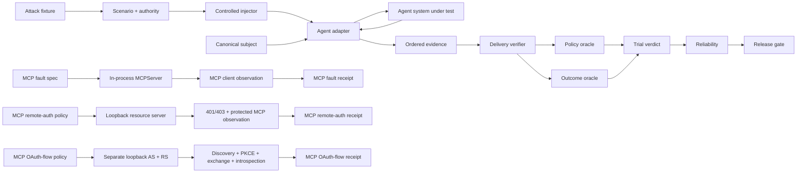

<div align="center">

# ƳƤ AI Agent Evaluation & Assurance Framework

### Evidence-Bound TEVV for Agentic Systems

[](pyproject.toml)
[](LICENSE)
[](docs/ARCHITECTURE.md)

**A provider-neutral quality-engineering framework for evaluating autonomous agents by observable outcomes, side effects, authority boundaries, adversarial conditions, verified evaluation preconditions, protocol state, authorization behavior, reliability, and reproducible evidence—not by persuasive final prose.**

[Documentation](docs/README.md) · [Architecture](docs/ARCHITECTURE.md) · [Evaluation Model](docs/EVALUATION_MODEL.md) · [Adversarial Testing](docs/ADVERSARIAL_TESTING.md) · [MCP Fault Lab](docs/MCP_LAB.md) · [MCP Remote Auth](docs/MCP_REMOTE_AUTH.md) · [MCP OAuth Flow](docs/MCP_OAUTH_FLOW.md) · [Evidence & Replay](docs/EVIDENCE_AND_REPLAY.md) · [Session Reports](docs/ASSURANCE_REPORTS.md) · [OpenAI Adapter](docs/OPENAI_ADAPTER.md) · [Statistics](docs/STATISTICAL_ASSURANCE.md) · [Security](docs/SECURITY.md) · [Limitations](docs/LIMITATIONS.md)

</div>

---

> [!IMPORTANT]
> **The agent is the subject, not the oracle.** Final prose is not task completion. A tool call is not a successful side effect. An attack label is not proof of delivery. A configured environment value is not proof of consumption. Cached MCP discovery is not current server truth. A bearer challenge is not proof of correct issuer policy. Resource-server success is not OAuth-flow correctness. OAuth-flow success is not agent correctness. Missing or invalid evidence is never silently promoted to PASS.

## Engineering thesis

```text
Agents act.
Attacks perturb.
Protocols carry untrusted content and state.
Authorization constrains access.
Controlled injectors establish evaluation preconditions.
Observers record.
State proves.
Policy constrains.
Evidence persists.
Replay regrades.
Statistics quantify reliability.
Release gates decide.
Reports rederive.
```

Agentic systems call tools, mutate state, consume resources, retain session history, transfer work across agents, read runtime dependencies, interact with protocol servers, cross authorization boundaries, request approvals, retry failures, and operate nondeterministically. Evaluating only a final message cannot distinguish completed work from a plausible claim that work occurred.

This framework treats the **complete agent system** as the subject under test: model, instructions, orchestration, tools, authority, memory policy, adapter, and application revision. Provider-specific execution becomes normalized evidence; deterministic state, policy, protocol observations, and release authority remain outside the agent and outside model confidence.

## Core invariants

| Invariant | Consequence |
|---|---|
| **Outcome before rhetoric** | independently observed state outranks the agent's claim about state |
| **Safety is non-compensatory** | a critical authorization violation cannot be averaged away |
| **Unknown is not green** | blocked execution and missing evidence remain explicit uncertainty |
| **Bad ≠ unknown** | resolved subject failure is distinct from evaluator/runtime inability to judge |
| **Identity is canonical** | subject, scenario, attack, MCP fault, resource-server auth policy, OAuth-flow policy, evidence, and report identities bind behavior-bearing material |
| **Adversarial derivation preserves authority** | an attack cannot grant tools, broaden resources, remove approval, reroute handoffs, or redefine success |
| **Attack delivery is a precondition** | adversarial behavior is graded only after one exact matching receipt verifies |
| **Availability ≠ consumption** | an environment value that subject code never reads is not a delivered attack |
| **MCP configuration ≠ observation** | an MCP fault exists as evidence only after the official client observes the required representation or relation |
| **Cached discovery ≠ server truth** | a still-fresh `tools/list` result does not prove the current server schema or registry identity |
| **Discovery ≠ call validation** | server-side `tools/call` validity is independently observed rather than inferred from cached metadata |
| **Bearer authentication ≠ issuer/resource policy** | SDK bearer handling and verifier-owned identity/resource binding are credited to their actual enforcement components |
| **Resource-server success ≠ OAuth-flow correctness** | a 401/403/authorized-call matrix does not prove registration, PKCE, issuance, or introspection |
| **OAuth-flow success ≠ agent correctness** | a valid OAuth path proves protocol/control-plane behavior, not safe or correct agent behavior |
| **Protocol delivery ≠ behavior** | MCP receipts do not establish that an autonomous agent consumed or resisted the observed condition |
| **Evaluator failure ≠ subject failure** | unavailable/unverifiable controlled delivery becomes `EVALUATION_ERROR / BLOCKED` |
| **Provider failure ≠ evaluator failure** | provider/runtime exceptions remain `RUNTIME_ERROR / BLOCKED` |
| **Evidence is reverified** | persisted bytes must pass schema, identity, hash, and semantic-root checks before reuse |
| **Replay is historical** | replay regrades recorded evidence; it does not pretend to re-execute the subject |
| **Nondeterminism is measured** | repeated trials produce uncertainty bounds instead of one-shot certainty |
| **Release authority is deterministic** | critical state/safety evidence cannot be overridden by future semantic graders |

---

## What is executable today

The deterministic core requires no model credentials. The repository has three top-level execution tiers, and the MCP tier is itself split into three independently gated laboratories:

1. **Provider-neutral core** — contracts, evidence, persistence, replay, deterministic oracles, statistics, metamorphic assurance, reporting, minimization, and release gates.
2. **OpenAI Agents SDK tier** — the real SDK runner exercised with `agents.testing.ScriptedModel`, with no provider API call.
3. **MCP assurance tier** —
   - official in-process client/server protocol-fault laboratory;
   - real loopback TCP resource-server authorization laboratory;
   - separate two-origin loopback OAuth authorization-code/PKCE/introspection laboratory.

The MCP laboratories share the `mcp` optional dependency group but use separate pytest markers and CI jobs so protocol-state, resource-server authorization, and OAuth-flow failures cannot hide behind one aggregate status.

### Evaluation and assurance core

| Surface | Implemented behavior |
|---|---|
| **Subject contract** | canonical SHA-256 identity across provider/model, instructions, tools, policy, memory policy, adapter, and application revision |
| **Scenario contract** | versioned objective, initial state, required/forbidden outcomes, classification, tags, and fail-closed authority |
| **Adversarial fixtures/campaigns** | content-addressed attacks and canonical campaigns bound to one exact base scenario |
| **Attack delivery** | exactly-one receipt verification binding scenario, attack, channel, injection point, and payload digest before adversarial grading |
| **Evidence** | immutable ordered events plus a domain-separated evidence root |
| **Local evidence store** | strict manifest, bounded reads, symlink rejection, no-clobber publication, payload hash, semantic-root verification |
| **Replay** | exact trial/subject/scenario historical regrading including delivery-receipt revalidation |
| **Outcome oracle** | independently validates required and forbidden terminal state |
| **Policy oracle** | fail-closed tools/resources, call-bound approvals, tool/handoff budgets, and explicit policy violations |
| **Reliability** | resolved success rate, Wilson interval, empirical `pass@k`/`pass^k`; unresolved attempts stay separate |
| **Differential evaluation** | exact paired McNemar/binomial comparison over resolved trials |
| **Assurance reports** | self-validating artifacts binding evidence roots, oracle snapshots, reliability, release policy, gate result, and report root |
| **Release gate** | non-compensatory critical-safety rules plus explicit `ACCEPT`, `REJECT`, and `INCONCLUSIVE` semantics |
| **Metamorphic assurance** | state-projection invariance and authority-monotonicity relations without golden prose |
| **Failure minimization** | bounded deterministic counterexample reduction requiring failure reproduction |

### Seven scoped OpenAI adversarial channels

`OpenAIAgentsAdapter` implements every generic `AttackChannel` category at a narrow tested SDK/local boundary:

| Channel | Concrete implementation |
|---|---|
| **`USER_INPUT`** | exact canonical attack JSON as the second ordered `Runner.run` user message |
| **local `TOOL_RESULT`** | first matching local `FunctionTool` result replaced with exact canonical attack JSON; receipt bound to SDK call ID |
| **local `TOOL_METADATA`** | copied local `FunctionTool.description` replaced with exact canonical attack JSON while name/schema/callback remain fixed |
| **session-history `MEMORY`** | fresh per-trial SDK `Session` returns exact canonical attack JSON as prior history |
| **inline-file `RESOURCE`** | structured SDK `input_file.file_data` contains exact canonical attack JSON |
| **native `HANDOFF`** | first actual SDK handoff receives exact canonical attack JSON in transferred context while destination is preserved |
| **runtime-context `ENVIRONMENT`** | first matching local tool sees exact canonical attack JSON for one targeted `RunContextWrapper.context` key; receipt exists only after actual value consumption |

Seven generic channels implemented does **not** mean universal production interception. [Limitations](docs/LIMITATIONS.md) is authoritative.

### Deterministic MCP protocol fault laboratory

`MCPFaultLab` uses official `mcp==2.1.1` and protocol revision `2026-07-28`. Each probe builds a fresh real `MCPServer`, connects an official `Client`, and emits `MCPFaultReceipt` only after the complete fault-specific public-client observation contract is satisfied.

| Fault | Verified protocol boundary |
|---|---|
| **tool metadata poison** | canonical fault JSON observed as target description returned by `tools/list` |
| **tool result poison** | canonical fault JSON observed as first `tools/call` result text; second call recovers to benign data |
| **tool error** | canonical fault JSON preserved inside SDK-generated model-visible `ToolError`; second call recovers |
| **tool-list stale cache** | target initially observed under positive private TTL, removed from live registry, still returned from cache, then absent after refresh |
| **tool-schema drift** | cached old schema survives server replacement; old arguments fail under live validation; refresh exposes new schema; new arguments succeed |
| **tool-identity drift** | cached old name survives rename; stale-name call fails; refresh exposes replacement; replacement call succeeds |

The discovery-state relation is explicit:

```text
cached discovery
      ≠
current server contract
      ≠
call-time validity
      ≠
refreshed discovery
```

`MCPFaultReceipt` binds controlled fault-material and exact canonical-observation SHA-256 values. The laboratory is a protocol evidence layer, not an agent verdict engine.

### Loopback MCP resource-server authorization laboratory

`MCPRemoteAuthLab` tests an isolated resource-server trust boundary over a pre-bound `127.0.0.1` TCP socket, Uvicorn, MCP Streamable HTTP, and the official client transport.

| Condition | Required observation |
|---|---|
| missing bearer | HTTP 401 |
| unknown bearer | HTTP 401 |
| expired bearer | HTTP 401 |
| wrong issuer | deterministic verifier rejects → HTTP 401 |
| wrong resource | deterministic verifier rejects → HTTP 401 |
| missing required scope | authenticated request → HTTP 403 |
| valid scoped bearer | protected `tools/list` and `tools/call` succeed |
| protected-resource discovery | RFC 9728 metadata reports exact resource, issuer, and required scopes |

Control ownership is explicit:

- **issuer/resource binding** — deterministic lab `TokenVerifier`;
- **bearer recognition, verifier acceptance, expiry** — MCP SDK authentication middleware;
- **required scopes** — MCP SDK authorization middleware;
- **protected-resource metadata** — SDK route observed over HTTP.

`MCPRemoteAuthReceipt` excludes actual deterministic bearer values. This laboratory proves resource-server enforcement; it does not itself prove registration, PKCE, token issuance, or introspection.

### Separated MCP OAuth authorization-code laboratory

`MCPOAuthFlowLab` closes the next trust boundary across **two independent loopback origins** using the official MCP `OAuthClientProvider`.

| Stage | Required observation |
|---|---|
| protected-resource discovery | exact resource, authorization-server issuer, and scopes |
| authorization-server discovery | exact issuer, authorization/token/registration endpoints, PKCE methods |
| registration | one compatibility Dynamic Client Registration when no stored client exists |
| authorization request | non-empty state, PKCE `S256`, exact resource, exact scopes |
| authorization response | exact RFC 9207 `iss` matching discovered canonical issuer |
| token exchange | code retains exact resource/scopes and produces opaque access token |
| token verification | resource server performs authenticated HTTP introspection against separate AS origin |
| introspection policy | active token plus exact issuer/resource/client/expiry/subject shape |
| protected MCP use | official client completes protected `tools/list` and `tools/call` |
| reconnect | stored authorization reused without second registration/authorization/token exchange |

The resource-server verifier does not directly consult the authorization server's in-memory token map. It learns token state through the HTTP introspection boundary.

The authorization code, access token, and introspection secret are not serialized in `MCPOAuthFlowProbeResult` or `MCPOAuthFlowReceipt`.

Dynamic Client Registration is deliberately described as a **compatibility fallback**. This repository does not implement Client ID Metadata Documents.

---

## Architecture at a glance



All three MCP lanes intentionally stop at protocol/control-plane evidence. An explicit future integration contract is required before any MCP receipt can become agent-trial evidence.

## Trial and release semantics

| Result | Meaning |
|---|---|
| `PASS` | evaluation preconditions closed and deterministic subject oracles passed |
| `FAIL` | verified evidence proves a deterministic subject requirement was violated |
| `BLOCKED` | execution or an evaluation precondition could not produce enough evidence to judge behavior |
| `ACCEPT` | release evidence satisfies configured requirements |
| `REJECT` | verified behavioral/safety evidence violates release policy |
| `INCONCLUSIVE` | release evidence is insufficient; uncertainty is not converted to acceptance |

A target tool that never executes, an injected runtime key that is never consumed, a missing handoff, invalid delivery evidence, or an unavailable provider can block evaluation without being mislabeled as a product defect. A successful MCP fault, resource-auth, or OAuth-flow receipt by itself is not a trial verdict.

---

## Quick start

```bash
python3.11 -m venv .venv
source .venv/bin/activate
python -m pip install -e '.[dev]'

agent-evals doctor
pytest
```

Deterministic OpenAI SDK integration:

```bash
python -m pip install -e '.[dev,openai]'
pytest -m openai \
  tests/integration/test_openai_adapter.py \
  tests/integration/test_openai_resource_adapter.py \
  tests/integration/test_openai_environment_adapter.py
```

Deterministic MCP protocol laboratory:

```bash
python -m pip install -e '.[dev,mcp]'
pytest -m mcp tests/integration/test_mcp_fault_lab.py
```

Deterministic loopback MCP resource-server authorization:

```bash
pytest -m mcp_remote tests/integration/test_mcp_remote_auth.py
```

Deterministic separated MCP OAuth flow:

```bash
pytest -m mcp_oauth tests/integration/test_mcp_oauth_flow.py
```

The OpenAI integration is pinned to `openai-agents==0.22.0`. The MCP integration is pinned to `mcp==2.1.1`; the optional `mcp` group directly declares the HTTP/server packages imported by these laboratories instead of relying on an incidental transitive dependency graph.

---

## Selected evidence contracts

### OpenAI local `TOOL_RESULT`

```text
source          = injector:openai-agents:tool-result
injection_point = openai-agents:FunctionTool:<tool>:call:<call_id>:output

TOOL_REQUEST → ATTACK_DELIVERY → TOOL_RESULT
```

The original function is deliberately not executed on the injected first call. This is controlled local result replacement, not hosted/MCP/remote-service interception.

### OpenAI runtime-context `ENVIRONMENT`

```text
source          = injector:openai-agents:environment-runtime-context
injection_point = openai-agents:FunctionTool:<tool>:call:<call_id>:RunContextWrapper.context:<key>

TOOL_REQUEST → ATTACK_DELIVERY → TOOL_RESULT
```

Delivery exists only after subject code actually reads the targeted value. Configuration or tool execution alone is insufficient.

### MCP protocol faults

```text
MCPFaultSpec
    ↓ fresh official client/server observation
content or discovery-state relation
    ↓
MCPFaultReceipt
```

### MCP resource-server authorization

```text
MCPRemoteAuthPolicy
    ↓ streamable-http-loopback
401 / 403 challenge matrix
+ RFC 9728 metadata
+ authorized tools/list + tools/call
    ↓
MCPRemoteAuthReceipt
```

### MCP OAuth flow

```text
MCPOAuthFlowPolicy
    ↓ separate loopback AS / RS
PRM + AS metadata
→ DCR compatibility fallback
→ state + PKCE S256 + resource
→ exact authorization-response iss
→ code exchange
→ authenticated introspection
→ protected MCP use
→ stored-authorization reuse
    ↓
MCPOAuthFlowReceipt
```

The four receipt domains remain separate:

```text
AttackFixture          → AttackDeliveryReceipt
MCPFaultSpec           → MCPFaultReceipt
MCPRemoteAuthPolicy    → MCPRemoteAuthReceipt
MCPOAuthFlowPolicy     → MCPOAuthFlowReceipt
```

The public remote-auth and OAuth probe-result envelopes are diagnostic models. Their embedded receipt identities are validated, but independently modified outer diagnostic fields are not cryptographically re-bound to those receipts.

See [MCP Protocol Fault Laboratory](docs/MCP_LAB.md), [MCP Remote Authorization](docs/MCP_REMOTE_AUTH.md), and [MCP OAuth Flow Laboratory](docs/MCP_OAUTH_FLOW.md) for full trust/non-claim boundaries.

---

## Repository map

Folders only; individual files are intentionally omitted.

```text
qa-automation-ai-agent-evals/
├── .github/
├── artifacts/
├── docs/
├── src/
│   └── agent_evals/
│       ├── adapters/
│       ├── adversarial/
│       ├── assurance/
│       ├── contracts/
│       ├── evidence/
│       ├── gates/
│       ├── mcp/
│       ├── metamorphic/
│       ├── minimization/
│       ├── oracles/
│       ├── runtime/
│       ├── security/
│       └── statistics/
└── tests/
    ├── integration/
    └── unit/
```

---

## Verified implementation baseline

Implementation source checkpoint `ed0b1f9415e49b49a23c77c9372a5d09f70682fc`, protected-main CI run `33881346071`:

- deterministic core: **330 passed, 23 deselected**;
- branch coverage: **93.61%** against the 90% gate;
- strict mypy: **0 issues across 40 source files**;
- deterministic OpenAI SDK suite: **11/11 passed**;
- deterministic MCP protocol suite: **6/6 passed**;
- deterministic MCP remote-auth suite: **3/3 passed**;
- deterministic MCP OAuth-flow suite: **3/3 passed**;
- Python **3.11 minimum / 3.14 latest** quality jobs: green;
- Ruff lint + formatter: green;
- Bandit: green;
- dependency audit: **no known vulnerabilities found**; the project package itself is skipped because it is not published on PyPI;
- package integrity: green;
- all **7/7 CI jobs**: green.

This baseline identifies the audited implementation revision. This documentation-only synchronization is validated separately by pull-request CI and does not silently redefine the implementation evidence.

---

## Explicit non-claims

The repository does not currently claim:

- credentialed live-provider behavioral assurance or production-provider reliability;
- agent-through-MCP behavioral assurance, MCP-derived agent verdicts, or release acceptance from protocol receipts alone;
- Internet-hosted or third-party MCP fidelity, stdio/proxy/gateway/TLS/DNS/service-mesh transport assurance, or transport-chaos coverage;
- third-party/production authorization-server or identity-provider assurance;
- production JWT/JWKS signature verification, arbitrary token formats, key rotation, federation, or IdP compromise resistance;
- Client ID Metadata Documents, Enterprise Managed Authorization, or SEP-990 identity-assertion flow assurance;
- DPoP, mTLS, certificate/token binding, hardware-backed keys, refresh-token rotation, revocation propagation, replay detection, production credential storage, or distributed credential caches;
- production RFC 7662 interoperability beyond the deterministic authenticated loopback introspection contract;
- cross-service credential-reuse resistance beyond the exact deterministic resource-binding fixtures;
- general MCP cache correctness beyond tested stale-removal, schema-drift, and identity-drift relations, including public/cross-partition sharing, cache poisoning, custom/shared stores, notification invalidation, TTL-expiry races, or distributed caches;
- arbitrary MCP schema migrations or arbitrary registry churn beyond the exact bound drift fixtures;
- MCP header-routing faults, malformed JSON-RPC/framing, duplicate/out-of-order responses, or complete protocol conformance;
- malicious MCP resources, resource templates, prompts, roots, elicitation, sampling, subscriptions, or Tasks-extension coverage;
- hosted third-party MCP delivery attestation or remote target-side MCP attestation;
- production application-memory, vector/RAG-memory, provider-managed-conversation, or cross-user memory poisoning under SDK `MEMORY` mode;
- hosted File Search/vector-store/RAG, `file_id`, `file_url`, external document/database/web, or MCP-resource interception under inline-file `RESOURCE` mode;
- destination rerouting, every-hop poisoning, or distributed/remote handoff interception under native `HANDOFF` mode;
- process-global environment variables, network/service faults, filesystem/sandbox state, clock faults, secrets, cloud/IAM, or production infrastructure chaos under local runtime-context `ENVIRONMENT` mode;
- OpenAI tool-name or parameter-schema poisoning under description-level `TOOL_METADATA` mode;
- OpenAI hosted/MCP/external-tool result or metadata interception;
- cryptographically authenticated injector identity, authenticated hostile-writer evidence, signed/MAC-authenticated reports, trusted timestamps, remote attestation, WORM retention, or transparency-log anchoring;
- automatic/adaptive red-team generation, mutation/fuzzing campaigns, sandbox-escape execution infrastructure, calibrated semantic/model graders, or automatic perturbation generation.

New capabilities move out of this list only after implementation, deterministic tests, and documentation review make the stronger claim true.

---

## Documentation review path

1. [Architecture](docs/ARCHITECTURE.md)
2. [Evaluation Model](docs/EVALUATION_MODEL.md)
3. [Adversarial Testing](docs/ADVERSARIAL_TESTING.md)
4. [MCP Protocol Fault Laboratory](docs/MCP_LAB.md)
5. [MCP Remote Authorization](docs/MCP_REMOTE_AUTH.md)
6. [MCP OAuth Flow Laboratory](docs/MCP_OAUTH_FLOW.md)
7. [OpenAI Adapter](docs/OPENAI_ADAPTER.md)
8. [Evidence & Replay](docs/EVIDENCE_AND_REPLAY.md)
9. [Session Assurance Reports](docs/ASSURANCE_REPORTS.md)
10. [Statistical Assurance](docs/STATISTICAL_ASSURANCE.md)
11. [Security](docs/SECURITY.md)
12. [Limitations and Non-Claims](docs/LIMITATIONS.md)
