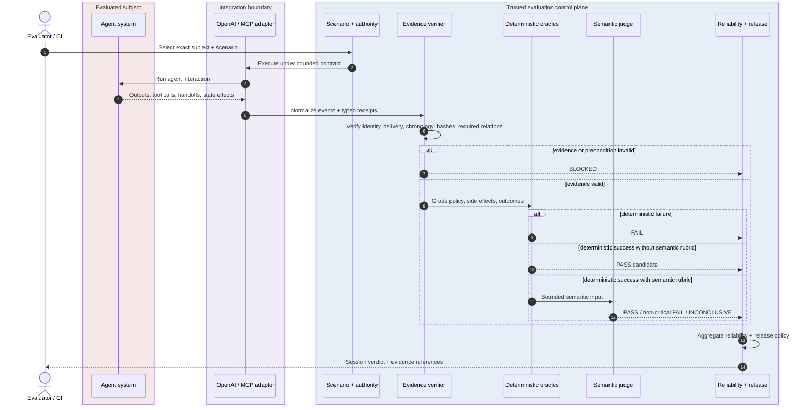
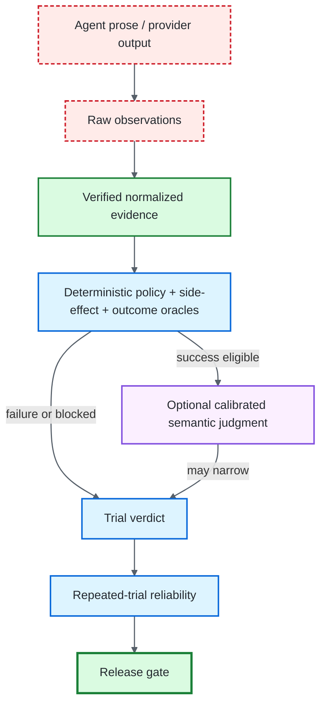

```mermaid
flowchart LR
    accTitle: Evidence-bound agent evaluation architecture
    accDescr: An evaluated agent system interacts with tools and protocols. Controlled adapters normalize observations into evidence. Deterministic evaluators verify preconditions, policy, side effects, outcomes, reliability, and release readiness. Semantic judging is subordinate and cannot rescue deterministic failure.

    O[Evaluation objective]

    subgraph SUBJECT[Evaluated subject · untrusted for grading authority]
      direction TB
      A[Agent runtime + model]
      T[Tools + application state]
      H[Handoffs + approvals + memory]
    end

    subgraph INTEGRATIONS[Observed integration boundaries]
      direction TB
      OA[OpenAI Agents SDK]
      MCP[MCP protocol + auth labs]
    end

    subgraph CONTROL[Trusted evaluation control plane]
      direction LR
      C[Scenario + authority contracts]
      D[Controlled delivery + adapters]
      E[Evidence + typed receipts]
      V[Deterministic verification]
      S[Subordinate semantic judging]
      R[Reliability + release gate]
    end

    O --> C
    C --> A
    A <--> T
    A <--> H
    A <--> OA
    OA <--> MCP
    T --> D
    H --> D
    OA --> D
    MCP --> D
    D --> E
    E --> V
    V -->|deterministic closure| S
    V -->|failure / blocked| R
    S -->|may narrow success| R

    classDef neutral fill:#f6f8fa,stroke:#57606a,color:#24292f,stroke-width:1.5px
    classDef advisory fill:#fbefff,stroke:#8250df,color:#24292f,stroke-width:2px
    classDef authority fill:#ddf4ff,stroke:#0969da,color:#24292f,stroke-width:2px
    classDef evidence fill:#dafbe1,stroke:#1a7f37,color:#24292f,stroke-width:2px
    classDef untrusted fill:#ffebe9,stroke:#cf222e,color:#24292f,stroke-width:2px,stroke-dasharray:5 3
    classDef terminal fill:#dafbe1,stroke:#1a7f37,color:#24292f,stroke-width:3px

    class O neutral
    class A,T,H untrusted
    class OA,MCP advisory
    class C,D,V authority
    class E evidence
    class S advisory
    class R terminal

    style SUBJECT stroke:#cf222e,stroke-width:2px,stroke-dasharray:6 4
    style INTEGRATIONS stroke:#8250df,stroke-width:2px,stroke-dasharray:6 4
    style CONTROL stroke:#0969da,stroke-width:2px,stroke-dasharray:6 4
    linkStyle default stroke:#57606a,stroke-width:1.5px
```

<div align="center">

# ƳƤ AI Agent Evaluation & Assurance Framework

### Evidence-Bound TEVV for Agentic Systems

[](pyproject.toml)
[](docs/OPENAI_ADAPTER.md)
[](LICENSE)
[](docs/ARCHITECTURE.md)

**A provider-neutral quality-engineering framework for evaluating autonomous agents by observable outcomes, side effects, authority boundaries, approval intent, adversarial conditions, protocol state, authorization behavior, reliability, and reproducible evidence—not by persuasive final prose.**

[Documentation](docs/README.md) · [Architecture](docs/ARCHITECTURE.md) · [Framework Surface](docs/FRAMEWORK_SURFACE.md) · [Evaluation Model](docs/EVALUATION_MODEL.md) · [OpenAI Adapter](docs/OPENAI_ADAPTER.md) · [Evidence & Replay](docs/EVIDENCE_AND_REPLAY.md) · [Security](docs/SECURITY.md) · [Limitations](docs/LIMITATIONS.md)

</div>

---

> [!IMPORTANT]
> **The agent is the subject, not the oracle.** Final prose is not task completion. Tool requests do not prove side effects. Approval requests do not prove authorization. Handoffs do not create delegation authority. Protocol receipts do not prove agent behavior. Semantic judgments cannot override deterministic failure. Missing or unverifiable evidence remains explicit uncertainty rather than becoming green.

## At a glance

| Engineering surface | Framework contract |
|---|---|
| **Subject under test** | model/provider configuration, instructions, orchestration, tools, authority, memory policy, adapter, and application revision |
| **Terminal truth** | deterministic policy, side-effect, outcome, and release logic derived from verified evidence |
| **OpenAI integration** | real Agents SDK execution paths with deterministic local test doubles for provider-independent CI plus narrow native handoff, HITL, retrieval, side-effect, semantic-judge, and MCP bridge adapters |
| **MCP assurance** | official-client protocol laboratories, resource-server authorization, OAuth flow, and explicit MCP→agent delivery bridges with separate receipts |
| **Adversarial assurance** | content-addressed attacks, controlled delivery preconditions, authority-preserving derivation, replayable evidence, and fail-closed grading |
| **Evidence model** | immutable ordered events, content-addressed identities, typed receipts, local persistence verification, replay, and report rederivation |
| **Reliability** | repeated trials, uncertainty-aware statistics, differential evaluation, non-compensatory safety rules, and deterministic release gates |
| **Security posture** | trust boundaries are explicit; external content may contribute evidence but does not acquire evaluator authority |
| **Documentation policy** | README and `/docs` describe evergreen contracts; executable dependency and interpreter truth lives in project manifests and repository-owned requirement files |

## Architecture at a glance



**Diagram key:** red dashed = evaluated/untrusted subject · purple = provider/protocol or semantic boundary · blue = deterministic evaluator authority · green = evidence and terminal release truth. Labels and boundaries carry the same meaning so color is never the only signal.

## Engineering thesis

**Agents act. Evaluators observe. Evidence binds. Policy constrains. State proves. Replay regrades. Statistics quantify. Release gates decide.**

The framework treats the complete agent system as the subject under test. Provider-specific execution is normalized into evidence, while deterministic state, authority, delivery verification, protocol observations, approval relations, and release policy stay outside the agent and outside model confidence.

That separation is deliberate: the component being evaluated must not be able to manufacture the authority or evidence that certifies its own success.

## Core invariants

| Invariant | Consequence |
|---|---|
| **Outcome before rhetoric** | independently observed state outranks the agent's claim about state |
| **Safety is non-compensatory** | critical authorization or policy violations cannot be averaged away |
| **Unknown is not green** | missing or unverifiable evidence becomes `BLOCKED`, not PASS |
| **Identity is canonical** | behavior-bearing subject, scenario, attack, approval, retrieval, protocol, evidence, and report material participates in content-addressed identity |
| **Delivery is a precondition** | an adversarial or protocol condition is graded only after the required controlled relation is verified |
| **Delegation never expands** | valid handoff paths preserve or reduce effective authority |
| **Approval is relational** | approval evidence must bind the exact pending invocation and accepted authority context |
| **Replay is historical** | replay revalidates persisted evidence without pretending to rerun side effects, approvals, or provider behavior |
| **Semantic judging is subordinate** | semantic evaluation may narrow deterministic success but cannot rescue deterministic failure |
| **Release authority is deterministic** | reliability and release decisions derive from verified trial evidence and explicit policy |

## Evaluation lifecycle



## Executable assurance surfaces

The implementation is intentionally split into separate trust domains. A green result in one lane never silently upgrades another.

| Lane | What it establishes | Deep dive |
|---|---|---|
| **Provider-neutral core** | contracts, evidence, replay, deterministic oracles, statistics, minimization, reports, release gates | [Framework Surface](docs/FRAMEWORK_SURFACE.md) |
| **OpenAI Agents SDK** | normalized real-SDK behavior plus native handoff, approval, retrieval, side-effect, semantic-judge, and MCP bridge paths | [OpenAI Adapter](docs/OPENAI_ADAPTER.md) |
| **MCP protocol labs** | controlled protocol faults through official client/server behavior | [MCP Fault Lab](docs/MCP_LAB.md) |
| **MCP authorization** | resource-server bearer/scope enforcement and separated OAuth control-plane behavior | [Remote Auth](docs/MCP_REMOTE_AUTH.md) · [OAuth Flow](docs/MCP_OAUTH_FLOW.md) |
| **Adversarial assurance** | attack identity, authority-preserving derivation, delivery verification, and fail-closed grading | [Adversarial Testing](docs/ADVERSARIAL_TESTING.md) |
| **Evidence and replay** | local evidence integrity, typed receipt verification, historical regrading, and report rederivation | [Evidence & Replay](docs/EVIDENCE_AND_REPLAY.md) |

See [Framework Surface](docs/FRAMEWORK_SURFACE.md) for the detailed executable inventory that previously lived in this README.

## Quick start

The deterministic core runs without model credentials.

```bash
python -m venv .venv
source .venv/bin/activate
python -m pip install -e '.[dev]'
pytest
agent-evals doctor
```

Optional integration lanes are installed through the repository extras defined in `pyproject.toml`:

```bash
python -m pip install -e '.[dev,openai,mcp]'
```

The project manifests and repository-owned requirement files are the authoritative source for supported interpreter and dependency requirements. Documentation keeps those executable requirements in repository configuration instead of duplicating them here.

## Evidence hierarchy



## Documentation map

The [documentation hub](docs/README.md) provides role-based review paths. The most useful entry points are:

| Question | Document |
|---|---|
| Where does authority live? | [Architecture](docs/ARCHITECTURE.md) |
| What is actually executable? | [Framework Surface](docs/FRAMEWORK_SURFACE.md) |
| How are PASS / FAIL / BLOCKED derived? | [Evaluation Model](docs/EVALUATION_MODEL.md) |
| How is model judgment constrained? | [Semantic Judging](docs/SEMANTIC_JUDGING.md) |
| How are handoffs and approvals authorized? | [Handoff Authority](docs/HANDOFF_AUTHORITY.md) · [Approval Intent](docs/APPROVAL_INTENT.md) |
| How are side effects and retrieval proven? | [Side-Effect Idempotency](docs/SIDE_EFFECT_IDEMPOTENCY.md) · [Retrieval Assurance](docs/RETRIEVAL_ASSURANCE.md) |
| How are adversarial conditions delivered? | [Adversarial Testing](docs/ADVERSARIAL_TESTING.md) · [Attack Delivery Authority](docs/ATTACK_DELIVERY_AUTHORITY.md) |
| How does OpenAI execution map into evidence? | [OpenAI Adapter](docs/OPENAI_ADAPTER.md) · [OpenAI Composition](docs/OPENAI_COMPOSITION.md) |
| How are MCP faults and authorization tested? | [MCP Lab](docs/MCP_LAB.md) · [Remote Auth](docs/MCP_REMOTE_AUTH.md) · [OAuth Flow](docs/MCP_OAUTH_FLOW.md) |
| How is evidence persisted and replayed? | [Evidence & Replay](docs/EVIDENCE_AND_REPLAY.md) · [Assurance Reports](docs/ASSURANCE_REPORTS.md) |
| What is deliberately not claimed? | [Security](docs/SECURITY.md) · [Limitations](docs/LIMITATIONS.md) |

## Repository map

Only top-level ownership boundaries are shown here; individual files are documented in the relevant technical pages.

```text
.github/
artifacts/
docs/
src/
tests/
```

## Scope and non-claims

The repository does **not** claim that local deterministic evidence proves live-provider correctness, hosted MCP behavior, production IAM, human identity, external target state, distributed exactly-once execution, generic cache coherence, arbitrary schema migration, universal prompt-injection resistance, or cryptographic publisher attestation.

Those boundaries are intentional. See [Security](docs/SECURITY.md) and [Limitations](docs/LIMITATIONS.md) for the precise assurance perimeter.

---

## License

MIT — see [LICENSE](LICENSE).
