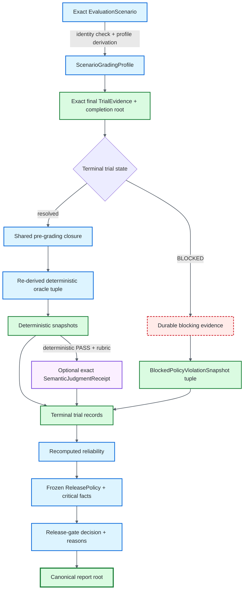

# Session Assurance Reports

## Purpose

`AssuranceReport` is a self-validating session-level artifact for review, CI handoff, and later audit. The current `agent-evals/assurance-report/<schema>` contract binds the `agent-evals/trial-evidence/<schema>` schema, exact trial evidence roots, the scenario-derived grading profile introduced in predecessor schema, deterministic oracle snapshots for resolved grading, explicit policy facts retained by blocked trials, subordinate semantic judgments when required, reproducible reliability configuration, frozen release policy, and the release-gate decision derived from that session.

The report is deliberately **not** another execution or grading authority. It preserves conclusions and verifies the report-level derivation that can be recomputed from the artifact itself.

## Why the current schema exists

The predecessor Assurance schema correctly separated `BLOCKED` from subject failure: blocked trials could not carry completed oracle snapshots or finalized semantic grading authority, and construction required durable evaluator/runtime blocking evidence. That prevented unknown evaluation outcomes from being mislabeled as bad subject behavior.

One safety fact was still lost. A trial can be correctly `BLOCKED` because one evaluation relation remains unresolved while also containing an explicit `POLICY_VIOLATION` that is already known. Native HITL turn-budget handling is a concrete example: the adapter can preserve a known turn-budget violation while refusing to fabricate a missing approval-continuation relation. Full deterministic grading is invalid, so the trial must remain `BLOCKED`; however, the known policy violation must not disappear when the report computes release criticality.

The predecessor schema derived `critical_violations` only from failed critical deterministic oracle snapshots. Because blocked trials correctly have no oracle snapshots, a release policy that tolerated one blocked trial could accept a session even when that blocked evidence retained an explicit policy violation and the policy required `max_critical_violations=0`.

The current schema closes that fail-open shape without regrading blocked evidence.

## Schema boundary

The current schema changes the Assurance artifact derivation surface and therefore uses a new schema and root domain rather than silently changing predecessor schema semantics:

- assurance report: `agent-evals/assurance-report/<schema>`
- evidence: `agent-evals/trial-evidence/<schema>` (unchanged)
- report-root domain: `agent-evals/assurance-report/<schema>\0`

The predecessor schema artifacts are rejected by the current report model. A predecessor schema report is not silently interpreted under current schema criticality semantics.

Historically:

- earlier schema added exact Wilson `confidence_z` persistence;
- predecessor schema added `ScenarioGradingProfile`, closing report-level semantic and side-effect grading-shape omission gaps;
- current schema retains those guarantees and adds blocked explicit-policy fact preservation.

## Authority separation

The current schema keeps four authority classes distinct:

1. **deterministic oracle snapshots** — completed framework grading for non-blocked trials. Framework-owned tuples are rederived from exact scenario/evidence during `from_session()` and must exactly equal the finalized runtime tuple;
2. **blocked explicit-policy snapshots** — bounded facts copied only from actual `POLICY_VIOLATION` events in blocked evidence. They affect release criticality but do not make the blocked trial fully graded;
3. **semantic judgment receipt** — calibrated meaning-level grading permitted only after deterministic PASS and only when required by the scenario grading profile;
4. **reliability/release derivation** — statistics and gate decisions recomputed from the validated trial records and frozen release policy.

Semantic grading remains subordinate to deterministic grading. It can narrow deterministic PASS into semantic FAIL or evaluator uncertainty, but it cannot rescue deterministic failure and never creates critical policy authority.

Blocked policy snapshots remain subordinate to the original evidence. They are not synthetic policy-oracle results and do not convert `BLOCKED` into `FAIL`.



## Scenario grading profile

`ScenarioGradingProfile` remains the minimal scenario disclosure surface introduced in predecessor schema. It records only scenario facts that determine report-level grading shape:

- `semantic_rubric_identity` — exact rubric identity or `null`;
- `side_effect_idempotency_identity` — exact side-effect contract identity or `null`.

The profile intentionally does not serialize the full scenario objective, state, authority, retrieval material, approval intent, required/forbidden outcomes, or tags. Those remain bound by `scenario_identity` and require the exact scenario/evidence replay path when their historical relations must be re-established.

For every non-`BLOCKED` trial, current schema enforces:

- `policy` and `outcome` exist exactly once;
- `side-effect-idempotency` exists exactly when the profile requires it;
- semantic grading is absent after deterministic failure;
- deterministic PASS has semantic judgment exactly when the profile requires it;
- semantic judgment is absent when no semantic rubric is configured;
- any semantic receipt binds the exact rubric identity committed by the profile.

## Construction-time verification

`AssuranceReport.from_session()` requires the exact scenario:

```python
report = AssuranceReport.from_session(
    session_result,
    scenario=scenario,
    release_policy=policy,
)
```

Construction snapshots and validates the scenario and requires:

```text
scenario.identity == session.scenario_identity
```

For every trial it also requires the final evidence root to equal the trial's completion root and checks subject identity, scenario identity, and trial-ID uniqueness.

### Resolved trials

For `PASS`, `FAIL`, and `INCONCLUSIVE`, construction rejects evaluator/runtime blocking evidence and reuses the same pre-grading closure as `TrialRunner`. That closure verifies adversarial delivery, protocol delivery, retrieval delivery, side-effect observation, composed handoff provenance where required, and stronger approval intent before deterministic grading is accepted.

After closure succeeds, the framework re-runs the same deterministic grading function used at runtime. The complete `OracleResult` tuple must exactly equal the finalized trial tuple: ordering, names, verdicts, reasons, and critical flags all matter.

Only then are `OracleSnapshot` records emitted.

If semantic grading is present, construction validates the semantic event/receipt relation against the exact scenario and evidence. Semantic authority cannot coexist with deterministic failure.

### Blocked trials

A `BLOCKED` trial must contain durable evaluator/runtime blocking evidence recognized by `has_blocking_evidence()`. It cannot carry completed oracle results or semantic judgment authority.

The current schema does **not** run deterministic oracles over blocked evidence. Doing so would turn evaluator uncertainty into subject failure when grading prerequisites did not close.

Instead, construction scans the exact blocked event stream for explicit `POLICY_VIOLATION` events and creates `BlockedPolicyViolationSnapshot` records only from those existing events.

Each snapshot records:

- event sequence;
- exact event digest;
- source;
- policy reason using the same defaulting semantics as `PolicyOracle`.

The digest binds the complete original event, including kind, source, payload, sequence, observed timestamp, and event-level critical flag. The source/reason fields are duplicated only for human review.

## Critical-violation semantics

For resolved trials, criticality remains deterministic-oracle-derived exactly as before:

- `policy` is critical when it fails;
- `side-effect-idempotency` is critical when it fails;
- `outcome` is never critical;
- semantic FAIL is never critical.

For blocked trials, the existence of one or more blocked policy snapshots contributes one policy-oracle-equivalent critical failure for that trial. This matches resolved `PolicyOracle` behavior: multiple policy reasons still produce one failed critical policy oracle result.

All explicit policy events are preserved as snapshots, even though the release counter contributes one critical unit for the blocked trial.

This makes safety non-compensatory without overstating authority:

- a release policy can tolerate evaluator-only blocked trials through `max_blocked_trials`;
- the same policy still rejects when the blocked trial contains a known explicit policy violation and `max_critical_violations=0`;
- the trial remains `BLOCKED` in reliability statistics and is not relabeled as a resolved failure.

## Per-trial record

Each `TrialAssuranceRecord` contains:

- `trial_id`;
- exact final `evidence_root`;
- terminal verdict;
- deterministic `oracle_results` for non-blocked trials;
- optional `semantic_judgment` for valid resolved semantic grading;
- `blocked_policy_violations` for blocked explicit policy facts.

Shape constraints are strict:

- `BLOCKED` has no completed oracle results and no semantic judgment;
- blocked-policy snapshots are allowed only on `BLOCKED` records;
- blocked-policy snapshot sequences are unique and increasing;
- blocked-policy event digests are unique;
- non-blocked records cannot smuggle blocked-policy snapshots;
- deterministic oracle names are unique;
- known framework-oracle criticality must match runtime semantics.

## Session-level record

At session level, the current schema records:

- schema revision `agent-evals/assurance-report/<schema>`;
- evidence schema `agent-evals/trial-evidence/<schema>`;
- subject identity;
- scenario identity;
- `ScenarioGradingProfile`;
- ordered trial records;
- frozen `ReleasePolicy`;
- reproducible reliability snapshot, including exact `k` and Wilson `confidence_z`;
- gate decision and reasons;
- domain-separated `report_root` over all report content except the root itself.

Blocked policy snapshots are part of each trial record and therefore part of `report_root`.

## What is recomputed on every load

Standalone Pydantic loading is not passive parsing. A current report must re-establish all report-level derivations available from the serialized artifact, including:

1. the exact current assurance schema and supported evidence schema;
2. unique trial IDs;
3. blocked/non-blocked record shape;
4. unique deterministic oracle names;
5. required core deterministic oracles for non-blocked trials;
6. known framework-oracle criticality semantics;
7. resolved deterministic oracle verdicts;
8. blocked-policy snapshot placement, ordering, and uniqueness;
9. side-effect oracle presence required by `ScenarioGradingProfile`;
10. semantic judgment precedence and rubric identity;
11. semantic subject/scenario identity;
12. terminal verdict derivation for non-blocked trials;
13. reliability from trial verdicts using exact `k` and `confidence_z`;
14. critical-violation count from resolved deterministic critical failures plus blocked policy-oracle-equivalent failures;
15. release-gate decision and reasons from reliability, criticality, and frozen policy;
16. canonical current `report_root` over the complete report content.

A caller cannot remove a blocked policy snapshot, change its review fields, alter a gate decision, or change criticality without also changing report content and recomputing the dependent root/gate. As with every content hash, an attacker who can rewrite the entire artifact can recompute a new internally consistent root; authenticated authorship is outside this artifact's claims.

## What standalone loading cannot prove

The report still does not embed the complete scenario preimage or event stream. Standalone parsing cannot independently prove:

- that a blocked-policy snapshot's digest corresponds to the original persisted event;
- that deterministic snapshots equal a fresh regrade of exact scenario/evidence;
- tool request/result chronology;
- side-effect before/after observations and operation-key binding;
- retrieval-delivery chronology;
- adversarial/protocol delivery relations;
- approval-intent chronology and evaluator-owned source roles;
- exact semantic pre-event envelope reconstruction.

Those event-level relations are established by `from_session()` while exact objects are present and can later be re-established through exact-identity evidence replay.

## Reliability and release integrity

`ReliabilityReport` validates its own counts and derived metrics. `ReleaseGate.decide(...)` validates reliability integrity before applying policy thresholds.

Assurance then recomputes the gate from:

```text
validated reliability
+ validated critical_violations
+ frozen ReleasePolicy
```

This means release authority does not depend on caller discipline, static typing, or a stale cached percentage.

Example:

```python
from agent_evals.assurance import AssuranceReport
from agent_evals.gates.release import ReleasePolicy

policy = ReleasePolicy(
    min_resolved_trials=20,
    min_success_rate=0.95,
    min_wilson_low=0.80,
    max_critical_violations=0,
    max_blocked_trials=1,
    max_inconclusive_trials=0,
)

report = AssuranceReport.from_session(
    session_result,
    scenario=scenario,
    release_policy=policy,
)

verified = AssuranceReport.model_validate_json(report.model_dump_json())
assert verified.schema_version == "agent-evals/assurance-report/<schema>"
assert verified.evidence_schema == "agent-evals/trial-evidence/<schema>"
assert verified.scenario_identity == scenario.identity
assert verified.report_root == report.report_root
```

If the one permitted blocked trial contains only evaluator/runtime blocking evidence, that tolerance can still apply. If it also contains an explicit `POLICY_VIOLATION`, the known policy fact contributes critical authority and can independently force rejection.

## Completion-root binding

`EvaluatedTrial.completion_evidence_root` remains a runtime-only finalization commitment. It prevents report construction from pairing post-finalization-mutated evidence with stale grading facts.

For semantic trials the completion root covers the final evidence envelope after the semantic event, while the nested semantic receipt separately binds the pre-semantic evidence root. For blocked policy snapshots, the final evidence root and each event digest together bind the historical blocked envelope and the exact explicit policy event selected from it during construction.

## Relationship to persistence and replay

The assurance and evidence layers remain intentionally separate:

- `LocalEvidenceStore` verifies persisted `TrialEvidence`;
- `EvidenceReplayAdapter` can resubmit historical evidence through evaluator-owned replay under exact subject/scenario identity;
- semantic replay validates historical semantic authority without calling a fresh semantic model;
- `AssuranceReport.from_session()` uses exact scenario/evidence to re-establish construction-time relations and derive current schema blocked policy snapshots;
- standalone current schema parsing revalidates the report-level commitments it actually contains;
- exact evidence replay remains the authority for reconstructing event-level chronology and snapshot-to-event correspondence.

The report can answer, "Does this stored session conclusion internally follow from the grading facts, blocked policy facts, grading-shape contract, statistical contract, and policy it contains?" It cannot by itself answer, "Would fresh execution produce the same observations now?"

## Integrity boundary

`report_root` is a domain-separated SHA-256 content-integrity root. It is not:

- a digital signature;
- a MAC;
- authenticated publisher identity;
- a trusted timestamp;
- remote attestation;
- proof that the referenced evidence was honestly produced.

Those are separate deployment and provenance concerns. current schema's guarantee is narrower and testable: known explicit policy facts retained by blocked evidence are no longer erased at the report/release boundary, while unresolved grading relations remain unresolved.
