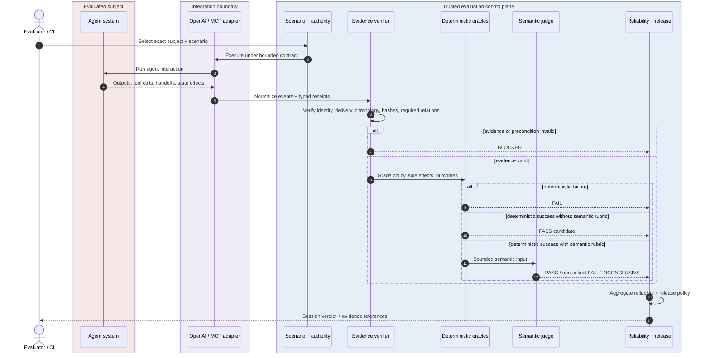

# Evaluation Lifecycle

## Purpose

This page owns the end-to-end lifecycle that turns one exact subject/scenario pair into verified evidence, deterministic grading, optional semantic narrowing, reliability aggregation, and a release decision.

The lifecycle is intentionally evidence-first: the evaluated agent never supplies the authority that certifies its own success.



## Lifecycle contracts

1. **Bind identity first.** The exact subject, scenario, authority policy, optional adversarial material and configured evaluation contracts establish the grading basis before execution.
2. **Observe through controlled boundaries.** Provider/protocol adapters normalize runtime observations without acquiring grading authority.
3. **Verify preconditions before grading.** Delivery receipts, approval relations, protocol bridges, chronology, hashes and other required evidence must close before behavior becomes gradeable.
4. **Run deterministic authority first.** Policy, side-effect and outcome oracles determine terminal safety/state truth before any model-based judgment.
5. **Semantic judging is subordinate.** A configured semantic judge may preserve or narrow deterministic success; it never rescues deterministic failure.
6. **Aggregate only resolved evidence.** Reliability and release policy operate on verified trial conclusions and preserve blocked uncertainty rather than converting it to success.

## Terminal semantics

```text
required evidence missing / unverifiable  → BLOCKED
verified evidence + deterministic violation → FAIL
verified evidence + deterministic closure   → PASS candidate
PASS candidate + semantic rubric            → PASS / non-critical FAIL / INCONCLUSIVE
repeated verified trials                     → reliability report + release gate
```

`BLOCKED` is not a softer FAIL and is not compensable by a score. It means the evaluator lacks sufficient trusted evidence to resolve the configured assurance contract.

## Related documentation

- [Evaluation Model](EVALUATION_MODEL.md) — vocabulary, deterministic precedence, semantic receipts and verdict semantics.
- [Architecture](ARCHITECTURE.md) — trust boundaries and authority ownership.
- [Framework Surface](FRAMEWORK_SURFACE.md) — executable assurance lanes.
- [Evidence & Replay](EVIDENCE_AND_REPLAY.md) — persistence, replay and semantic revalidation.
- [Statistical Assurance](STATISTICAL_ASSURANCE.md) — repeated-trial inference.
- [Assurance Reports](ASSURANCE_REPORTS.md) — report and release-gate derivation.
