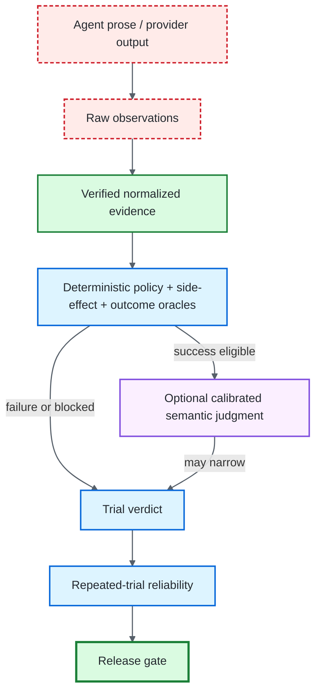

# Evidence Hierarchy

## Purpose

This page defines the authority ordering from raw agent/provider output to terminal release decisions. It exists to prevent persuasive model output, provider receipts, or semantic scores from being mistaken for evaluator-owned truth.

**Diagram key:** red dashed = untrusted subject/provider material · green = verified evidence or terminal release truth · blue = deterministic evaluator authority · purple = subordinate semantic judgment.

## Authority rules

- **Agent prose is an observation, not an outcome.** A statement such as “the refund was created” cannot close a required state condition without independently observed evidence.
- **Tool requests are intent, not side effects.** The evaluator distinguishes a requested action from an observed authorized mutation.
- **Receipts establish bounded relations.** Typed delivery, approval, retrieval, side-effect and protocol receipts can establish required preconditions; they do not become general grading authority.
- **Deterministic failure is terminal.** Critical policy or state violations cannot be averaged away or rescued by semantic quality.
- **Semantic judging can only narrow success.** A calibrated semantic judge sees bounded input only after deterministic closure and may preserve PASS, produce non-critical FAIL, or abstain/inconclude.
- **Unknown remains explicit.** Missing, malformed, contradictory or unverifiable evidence produces `BLOCKED` rather than a synthetic green result.
- **Reliability derives from trial evidence.** Repeated-trial statistics quantify resolved historical observations; they do not replace per-trial evidence verification.
- **Release authority remains deterministic.** Release policy consumes verified verdict/reliability evidence under explicit non-compensatory rules.

## What each layer may claim

| Layer | May establish | Must not claim |
|---|---|---|
| Agent/provider output | What the subject/provider emitted | External state, authorization or correctness |
| Raw observation | That a boundary emitted an observable value | Integrity or semantic validity before verification |
| Verified normalized evidence | Exact bounded relation/identity/chronology under evaluator rules | Universal provenance or cryptographic publisher identity |
| Deterministic oracle | Policy, side-effect and outcome conclusions from verified evidence | Meaning-level quality outside its contract |
| Semantic judge | Bounded meaning-level judgment after deterministic success | Authority to override deterministic failure |
| Trial verdict | Resolved PASS/FAIL/INCONCLUSIVE/BLOCKED semantics for one trial | Reliability across repeated trials |
| Reliability report | Statistical summary of repeated resolved observations | Independence/reset claims not established by the integration |
| Release gate | Deterministic acceptance under configured policy | Safety/correctness beyond the evidence and policy scope |

## Replay implications

Replay revalidates historical evidence and rederives deterministic conclusions. It does not recreate external side effects, approvals, model/provider behavior, retrieval, protocol traffic, or current service availability.

A historical hash or evidence root is an integrity relation to a trusted reference, not a signature. See [Evidence Persistence and Replay](EVIDENCE_AND_REPLAY.md) for the persistence and exact-identity replay contract.

## Related documentation

- [Evaluation Lifecycle](EVALUATION_LIFECYCLE.md) — how evidence moves through verification and grading.
- [Evaluation Model](EVALUATION_MODEL.md) — verdict precedence and semantic judging.
- [Architecture](ARCHITECTURE.md) — trust boundaries and control-plane ownership.
- [Evidence & Replay](EVIDENCE_AND_REPLAY.md) — persistence and historical regrading.
- [Security](SECURITY.md) — trust perimeter and non-claims.
