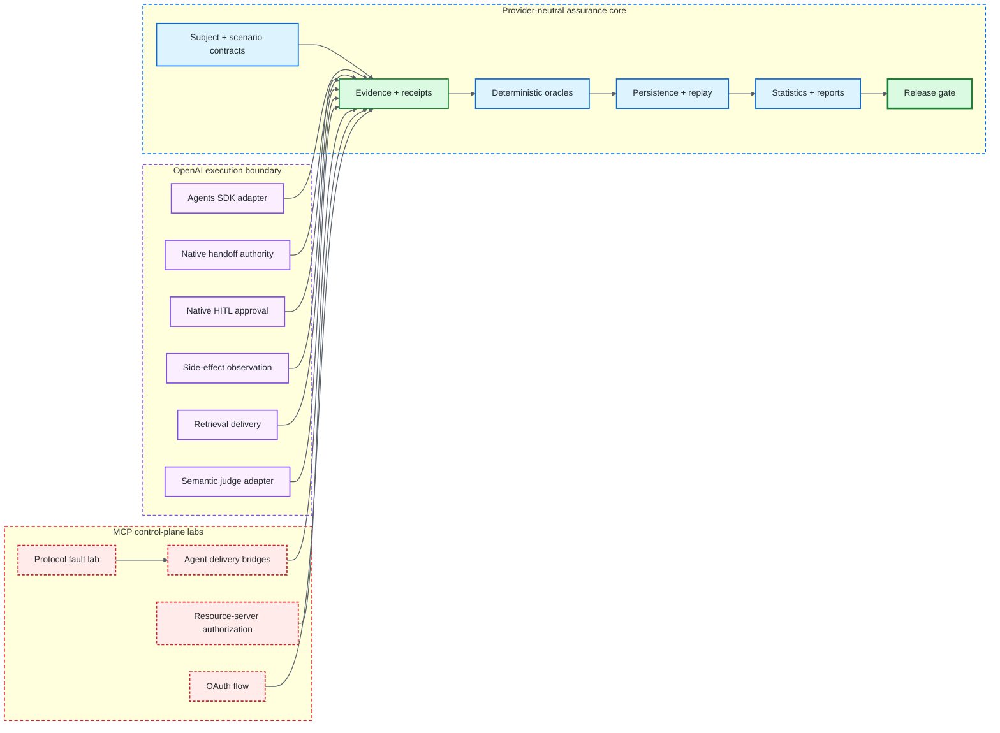
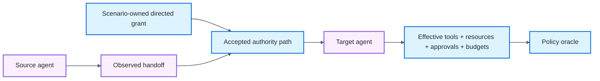
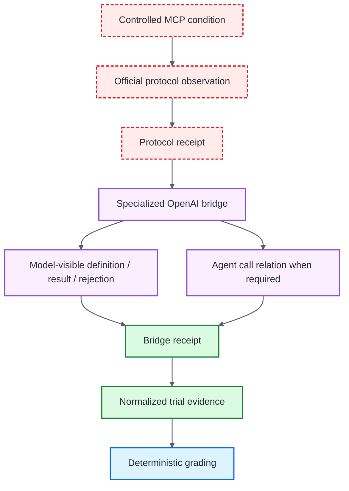
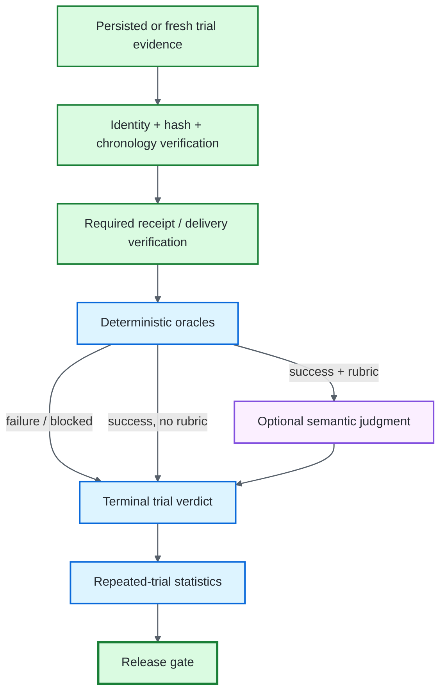

# Framework Surface

## Purpose

This page is the detailed inventory behind the root README's compact overview. It describes **what is executable, which component owns each assurance claim, and where evidence crosses trust boundaries**.

The framework intentionally separates provider-neutral grading, OpenAI execution, MCP protocol behavior, authorization, adversarial delivery, semantic evaluation, persistence, replay, statistics, and release policy. A successful observation in one domain never silently upgrades another domain.

## Executable lanes



**Diagram key:** blue = deterministic evaluator authority · green = evidence/release truth · purple = OpenAI execution or semantic boundary · red dashed = protocol/control-plane boundary whose observations still require verification.

## Provider-neutral assurance core

The deterministic core requires no model credentials. It owns the contracts and evaluators that decide whether a trial is gradeable and, if so, what conclusion the evidence supports.

| Surface | Implemented behavior |
|---|---|
| **Subject identity** | content-addressed identity over provider/model configuration, instructions, tools, policy, memory policy, adapter identity, and application revision |
| **Scenario identity** | objective, initial state, authority, required/forbidden outcomes, classification, tags, and optional specialized assurance contracts participate in scenario identity |
| **Evidence** | immutable ordered events plus a domain-separated evidence root |
| **Delivery preconditions** | attack, retrieval, approval, side-effect, and protocol bridge relations are reverified before grading when the scenario requires them |
| **Policy oracle** | fail-closed tool/resource authority, approval semantics, handoff authority, budgets, chronology, and explicit policy violations |
| **Side-effect oracle** | optional critical verification that repeated logical attempts did not create impermissible duplicate physical effects |
| **Outcome oracle** | independently validates required and forbidden terminal state |
| **Semantic precedence** | semantic judging is invoked only after deterministic success and can only preserve or narrow that result |
| **Persistence** | bounded local evidence publication with identity, payload hash, semantic-root, no-clobber, and symlink checks |
| **Replay** | historical regrading of recorded evidence without pretending to rerun subject side effects or approval interruptions |
| **Reliability** | repeated-trial statistics and differential comparison over resolved outcomes while unresolved trials remain explicit |
| **Release gate** | non-compensatory critical-safety policy plus explicit acceptance, rejection, and inconclusive semantics |
| **Metamorphic assurance** | state-projection invariance and authority-monotonicity relations without brittle golden prose |
| **Failure minimization** | bounded deterministic counterexample reduction requiring failure reproduction |

## OpenAI Agents SDK tier

The OpenAI tier uses the real Agents SDK surface while keeping CI provider-independent through deterministic model doubles. It normalizes SDK behavior into the provider-neutral evidence model and owns only the relations its adapters can actually observe.

### Generic agent execution

`OpenAIAgentsAdapter` covers scoped local/SDK adversarial boundaries such as user input, local tool output, local tool metadata, session history, inline resources, native handoff context, and targeted runtime context. These are deliberately local assurance boundaries rather than claims about arbitrary hosted interception.

### Native handoff authority

Handoff evidence records **what happened**; scenario-owned grants determine **what was authorized**. The deterministic policy oracle verifies that authority never expands across an accepted path.



See [Handoff Authority](HANDOFF_AUTHORITY.md).

### Native HITL approval intent

The approval adapter binds one evaluator-owned approve/reject decision to one exact pending invocation, canonical arguments, resource, accepted authority context, and continuation. The resulting receipt is evidence about that relation; it is not proof of human identity, enterprise workflow attestation, or production IAM.

See [Approval Intent](APPROVAL_INTENT.md).

### Run-local side-effect idempotency

The side-effect adapter preserves the real callback on repeated attempts and samples evaluator-owned effect state immediately around execution. A verified duplicate physical mutation can therefore fail critically even when tool results look identical.

See [Side-Effect Idempotency](SIDE_EFFECT_IDEMPOTENCY.md).

### Deterministic retrieval assurance

The retrieval adapter binds evaluator-owned corpus/query/ranker/optional-poison identity to one exact model-visible retrieval result. Delivery must close before adversarial behavior is graded.

See [Retrieval Assurance](RETRIEVAL_ASSURANCE.md).

### Calibrated semantic judging

The semantic judge receives only bounded objective, rubric, and candidate output material after deterministic policy/outcome success. Its structured judgment is subordinate evidence: PASS cannot rescue deterministic failure, FAIL is non-critical, and abstention remains inconclusive.

See [Semantic Judging](SEMANTIC_JUDGING.md).

## MCP protocol and authorization laboratories

MCP assurance is separated into three domains because protocol-fault delivery, resource-server authorization, and OAuth control-plane correctness prove different things.

| Domain | What it proves | What it does not prove |
|---|---|---|
| **Protocol fault lab** | official client/server observation of controlled metadata, result, error, stale discovery, schema change, and identity change relations | agent attention, interpretation, resistance, or behavioral correctness |
| **Resource-server authorization** | loopback bearer validation, issuer/resource binding, required scopes, and protected-tool enforcement | authorization-code flow correctness or agent correctness |
| **OAuth flow** | discovery, client registration compatibility, authorization code, PKCE, issuer/resource validation, token exchange, introspection, protected MCP use, and reconnect reuse | safe agent behavior or production IdP correctness |

See [MCP Fault Lab](MCP_LAB.md), [Remote Authorization](MCP_REMOTE_AUTH.md), and [OAuth Flow](MCP_OAUTH_FLOW.md).

## OpenAI ↔ MCP delivery bridges

The repository contains narrow bridge adapters that connect verified MCP observations to exact model-visible or agent-call relations. Each bridge emits its own typed receipt only after the complete relation closes.



The supported bridge families cover:

- exact discovery metadata → model-visible tool definition;
- exact protocol result → same agent call/result relation;
- model-visible tool error → causal same-argument retry → recovery;
- hidden live target removal → stale cache → real rejection → host refresh → target-absent model delivery;
- hidden live schema replacement → stale-call rejection → host refresh → corrected call against the replacement contract;
- hidden live identity replacement → stale-name rejection → host refresh → replacement-only model visibility → replacement-name call.

The host/evaluator owns cache invalidation for the refresh-oriented bridges. The model is credited only for changing behavior **after** the refreshed contract becomes model-visible. These paths do not claim model-initiated refresh, generic cache coherence, arbitrary schema migration, or universal rename recovery.

See [OpenAI Adapter](OPENAI_ADAPTER.md), [MCP Stale Cache](MCP_STALE_CACHE.md), and [MCP Identity Drift](MCP_IDENTITY_DRIFT.md).

## Evidence-to-release pipeline



## Verification commands

The repository manifests define the authoritative dependency and interpreter requirements. Documentation intentionally keeps those pins out of prose.

Core verification:

```bash
python -m pip install -e '.[dev]'
pytest
agent-evals doctor
```

Optional integration verification:

```bash
python -m pip install -e '.[dev,openai,mcp]'
pytest -m openai
pytest -m mcp
pytest -m mcp_remote
pytest -m mcp_oauth
```

CI remains the canonical repository-wide integration surface because it exercises the supported interpreter matrix and repository-owned security/quality controls.

## Non-claims

The executable surface does not itself establish:

- live-provider correctness or availability;
- hosted or arbitrary remote MCP correctness;
- production IAM, human identity, or enterprise approval attestation;
- target-side attestation or cryptographic publisher identity;
- distributed exactly-once execution or crash/concurrency safety;
- production retrieval correctness;
- generic cache coherence, arbitrary schema migration, or universal identity migration;
- universal prompt-injection resistance;
- Internet/TLS/proxy/cloud controls outside the repository boundary.

Those limits are part of the assurance model rather than omissions to hide. See [Security](SECURITY.md) and [Limitations](LIMITATIONS.md).
