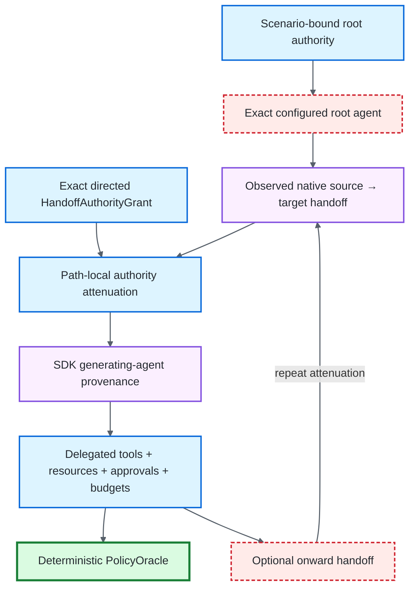

# Native Handoff Authority

## Purpose

Native multi-agent handoffs change **which agent is acting**. A handoff therefore cannot be treated as only a routing event or only a counter against `max_handoffs`: the receiving agent must have an explicit, scenario-bound authority grant, and that grant must never broaden the authority that reached the source agent.

This repository implements one deterministic OpenAI Agents SDK boundary for that claim. The framework owns the authority graph and grading rules; the repository-governed SDK supplies run-local evidence about which agent generated each observed run item.



## Why a handoff counter is insufficient

The ordinary `AuthorityPolicy` already constrains root tools, forbidden tools, typed resource scopes, approval requirements, total tool calls, and total handoffs. Before this boundary existed, normalized `HANDOFF` evidence recorded `source_agent` and `target_agent`, but the deterministic policy oracle used that event only for the global handoff budget.

That was intentionally conservative but incomplete for multi-agent authorization: after a handoff, a receiving agent could still be graded against the scenario-wide root authority because no path-local delegated authority existed.

The handoff-authority path closes that gap without making the provider SDK the policy engine.

## Scenario contract

`AuthorityPolicy` may declare an exact `root_agent` and a canonical tuple of immutable `HandoffAuthorityGrant` values.

Each grant binds:

- exact `source_agent`;
- exact `target_agent`;
- target `allowed_tools`;
- target `allowed_resource_scopes` as versioned `ResourceScope` values;
- `additional_approval_required_tools` that can make the child stricter;
- target `max_tool_calls`;
- target `max_handoffs`.

The graph is content-addressed through the existing `EvaluationScenario.identity`; there is no separate provider-owned policy identity. Typed scope schema version, kind, domain, and components are behavior-bearing scenario material.

### Configuration invariants

Configuration fails closed when:

- grants exist without an exact root agent;
- an agent identity is empty or contains surrounding whitespace;
- a grant transfers to the same agent identity;
- duplicate `(source_agent, target_agent)` transitions exist;
- an additional approval requirement references a tool the child was not delegated;
- a grant includes a tool outside root authority;
- a grant resource scope is not structurally contained by root resource authority;
- a grant tool or handoff budget exceeds the root outer ceiling;
- any configured transition is unreachable from the root in the declared directed graph;
- legacy `allowed_resource_prefixes` material is supplied, including mixed typed/lexical configuration.

Grant ordering is canonicalized by transition identity, so equivalent graph material produces the same scenario identity independent of construction order. Resource scopes are canonicalized by their exact canonical typed JSON.

Static graph reachability does **not** silently prove runtime attenuation. A later edge can be globally legal relative to root authority yet still be too broad relative to the narrower authority that actually reached its source. That relation is checked from observed runtime chronology.

## Effective authority

At runtime the policy oracle maintains one active agent and one effective authority value.

The initial effective authority is the root scenario authority:

```text
allowed tools           = root allowed_tools - forbidden_tools
approval requirements   = root approval_required_tools
resource scopes         = root allowed_resource_scopes
tool-call budget        = root max_tool_calls
handoff budget          = root max_handoffs
active agent             = exact root_agent
```

A valid handoff creates child effective authority from its matching grant only after proving the grant does not broaden the current source authority.

### Tool attenuation

```text
child.allowed_tools ⊆ source.allowed_tools
```

A tool lost on one hop cannot reappear on a later hop merely because it was legal for the root.

### Resource attenuation

Every child `ResourceScope` must be structurally contained by at least one source scope using the versioned resource algebra. Containment requires exact schema version, resource kind, and domain, followed by tuple-component prefix containment. No string `startswith` fallback exists.

For example, within domain `tenant`:

```text
source components: ("7",)
child:             ("7", "orders")        ✓ narrower
child:             ("7", "orders", "open") ✓ narrower
child:             ("8",)                  ✗ unrelated
child:             ("70",)                 ✗ unrelated
```

The component boundary is semantic: `("1",)` does not contain `("10",)` or `("1-shadow",)`. Identical components in another domain are unrelated.

### Approval monotonicity

Approval requirements on retained tools are inherited. A child grant may add requirements but cannot remove an inherited requirement:

```text
child approvals
  = (source approvals ∩ child allowed tools)
    ∪ child additional approval requirements
```

Legacy call-scoped and persistent tool-scoped `APPROVAL` semantics remain unchanged for scenarios that do not opt into stronger native HITL assurance. Separately, `ApprovalIntentSpec` + `APPROVAL_DECISION` can bind one exact native SDK interruption to its call identity, canonical arguments, exact typed resource identifier, **accepted authority epoch**, and **exact accepted handoff-path hash**. Legacy approval evidence cannot satisfy or override that stronger contract. See [Native HITL Approval Intent](APPROVAL_INTENT.md).

### Budget attenuation

```text
child.max_tool_calls ≤ source.max_tool_calls
child.max_handoffs   ≤ source.max_handoffs
```

The oracle also retains the root/global `max_tool_calls` and `max_handoffs` as non-compensatory outer ceilings.

Per-agent delegated counts are cumulative for the run-local agent identity. Re-entering the same named agent does not reset its delegated budget.

## Runtime handoff chronology

When handoff authority is enabled:

1. the specialized adapter first verifies that the supplied SDK root Agent name exactly equals configured `root_agent`;
2. the active agent begins as that root;
3. each `HANDOFF` event must contain exact non-empty `source_agent` and `target_agent` identities;
4. the observed source must equal the currently active agent;
5. one exact directed grant must exist for the transition;
6. the grant must attenuate the current source authority, including structural resource-scope containment;
7. only then does the target become active;
8. later tool and approval requests must carry canonical typed resource identity whenever the active authority path is resource-scoped, and are graded against that effective authority;
9. onward handoffs repeat the same process.

An invalid handoff never advances the active-agent state, accepted authority epoch, or accepted path identity. Subsequent evidence therefore cannot use a malformed, unauthorized, wrong-source, or re-expanding transition to acquire authority indirectly or to spoof an approval context.

## OpenAI SDK provenance boundary

`OpenAIAgentsHandoffAuthorityAdapter` is deliberately separate from the base `OpenAIAgentsAdapter`.

The base adapter continues to provide the general OpenAI execution and adversarial-channel normalization contract. The stronger handoff adapter adds provenance needed for delegated-authority grading from repository-governed public SDK run-item surfaces.

With `openai-agents`:

- public run items expose the Agent that generated the item;
- native handoff output exposes explicit source and target Agents;
- tool request, tool result, and approval-request items carry stable call identities.

The adapter binds the public SDK generating-agent name onto normalized tool request/result/approval-request evidence. A configured resource resolver must explicitly return an exact `ResourceIdentifier`; the adapter does not infer resource domains or components from URLs, filesystem paths, object keys, provider locator strings, or arbitrary tool arguments.

For each completed tool call it also requires:

```text
request.call_id == result.call_id
request.agent   == result.agent
```

A result with no attributed request, a reused/ambiguous call identity, or disagreement about the generating agent is evaluator uncertainty and fails closed.

For native handoffs, the run item's generating agent must equal the SDK handoff source agent before the normalized source/target relation is accepted.

## Root identity is a precondition

The configured root identity is verified **before** provider execution when handoff authority is enabled.

```text
AuthorityPolicy.root_agent
        ==
supplied OpenAI SDK Agent.name
```

A mismatch becomes `handoff_root_agent_mismatch / EVALUATION_ERROR / BLOCKED` before the deterministic model executes. This matters even for a path that ultimately makes no tool call or handoff: root provenance cannot depend on a later behavioral event happening to reveal the identity.

## Policy grading

The SDK never decides whether an action is authorized.

The separation is:

```text
OpenAI SDK public run item
        ↓ supplies run-local agent identity
OpenAIAgentsHandoffAuthorityAdapter
        ↓ normalizes provenance and explicit typed resource identity
TrialEvidence
        ↓
pre-grading evidence closure
        ↓
scenario-bound AuthorityPolicy
        +
PolicyOracle
        ↓ decides authorization
PASS / FAIL contribution
```

Provider evidence answers **who generated the observed run item inside this controlled SDK execution**. The scenario contract answers **what that agent was allowed to do**. Resource identity is evaluator-owned typed evidence; it is not inferred from agent prose.

## Failure semantics

Two failure classes remain distinct.

### Evaluator/provenance uncertainty → `BLOCKED`

Examples:

- configured root does not match the supplied SDK Agent;
- SDK run item lacks a stable generating-agent name;
- SDK tool call lacks a stable call identity;
- result has no matching attributed request;
- request/result generating-agent identities disagree;
- handoff run-item generating agent disagrees with the SDK handoff source;
- resource evidence is a raw legacy string, malformed/non-canonical typed material, or otherwise cannot establish one exact `ResourceIdentifier`;
- a tool or approval request omits resource identity while the active effective authority is resource-scoped.

These are evaluator precondition conditions. The framework cannot establish the evidence relation required to grade delegated behavior. In particular, unknown resource identity is not converted into a subject policy failure merely to obtain a resolved verdict.

### Verified policy violation → critical `FAIL`

Examples:

- handoff destination has no configured grant;
- observed handoff source is not the active agent;
- a runtime grant re-expands authority lost on an earlier hop;
- delegated agent calls a tool outside its effective authority;
- a canonical typed resource is outside the delegated agent's effective resource scopes;
- delegated agent omits a required approval;
- delegated tool or handoff budget is exceeded;
- replayed/manually supplied handoff-authority evidence has sufficient canonical provenance to establish an unauthorized action.

These are resolved deterministic authorization failures, not evaluator uncertainty.

## Single-authority compatibility

A scenario with no `root_agent` and no handoff grants retains the single-authority policy behavior. Existing tool/legacy-approval/global-budget semantics remain intact, while resource authorization uses the same typed `ResourceScope`/`ResourceIdentifier` contract as delegated authority. There is no lexical-prefix compatibility mode or silent converter.

A scenario that enables handoff authority but is run through a weaker adapter does **not** silently fall back to root authority. When required generating-agent or typed-resource provenance cannot be established, evaluation fails closed rather than inventing authority.

The native HITL approval-intent path is also opt-in and separate. Enabling `ApprovalIntentSpec` does not mutate the meaning of historical `APPROVAL` events; it introduces a stronger exact-interruption relation that only `APPROVAL_DECISION` evidence can satisfy.

## Replay semantics

No new **handoff** receipt type is introduced.

Handoff and tool events already live in the same normalized subject-evidence domain, while the scenario itself already binds the authority contract. Historical replay therefore regrades the persisted evidence against the exact persisted scenario identity and the same deterministic `PolicyOracle` semantics.

Replay does not recreate SDK agent provenance or repair resource identity. It verifies the historical evidence that was recorded. If required run-local agent attribution or canonical typed resource material is absent or malformed, pre-grading closure remains unresolved and replay blocks rather than guessing. If canonical evidence establishes an unauthorized resource or action, policy grading can deterministically fail it.

Approval intent is a separate receipt domain because it binds a decision to one exact pending interruption and continuation. Replay semantically revalidates that receipt and its accepted authority epoch/path before policy grading. See [Native HITL Approval Intent](APPROVAL_INTENT.md) and [Evidence & Replay](EVIDENCE_AND_REPLAY.md).

## Deterministic verification

The implementation is covered at two levels:

- provider-neutral unit/property tests for canonical graph identity, configuration rejection, one-/multi-hop attenuation, unauthorized transitions, structural resource/tool confinement, approval monotonicity, delegated budgets, re-expansion rejection, missing agent/resource identity, exact accepted path identity, component-boundary/cross-domain separation, and single-authority behavior;
- real pinned-SDK tests using `agents.testing.ScriptedModel` for one-hop and two-hop native handoffs, actual run-item agent attribution, fail-closed weaker-adapter behavior, root mismatch before model execution, typed resource resolver evidence, and the separate native HITL handoff→approval→resume path.

No provider API call is required.

## Explicit non-claims

This boundary does **not** establish:

- cryptographic agent identity;
- globally unique agent names outside the evaluated SDK run;
- organization, user, workload, or service identity;
- provider-side authorization enforcement;
- remote or distributed agent-fabric attestation;
- cross-process or cross-host delegation;
- hosted-agent routing assurance;
- production IAM or credential delegation;
- enterprise approval-workflow correctness or authenticated human approval;
- correctness of arbitrary orchestration frameworks outside the pinned OpenAI SDK boundary;
- target-system enforcement merely because the evaluator detected a violation;
- canonical semantics for URLs, filesystem or Windows paths, cloud object keys, database identifiers, MCP URIs, host aliases, percent-encoded external names, or provider-specific locators merely because they can be represented as strings or components.

The typed resource domain is evaluator-defined. A resolver mapping an external locator into `ResourceIdentifier` material is an explicit evaluation contract, not proof that the target service shares the same aliasing, canonicalization, authentication, or authorization semantics.

The narrow claim is: **inside the pinned deterministic OpenAI Agents SDK execution boundary, scenario-owned directed grants plus evidence-bound run-item agent identity prove that each observed native handoff follows an explicitly authorized path and that effective tool/resource/approval/budget authority never expands along that path under the evaluator's versioned typed resource algebra.** The separate approval-intent contract can additionally bind one exact native HITL decision to that accepted path, but it does not turn the handoff graph into production IAM or human-authentication evidence.

[← Documentation hub](README.md)
