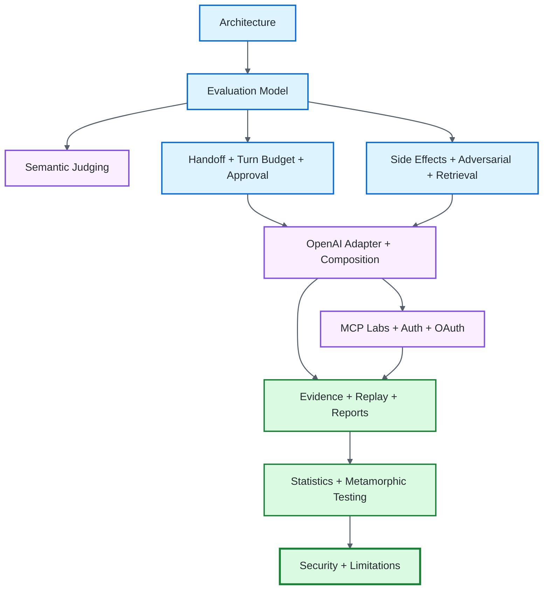

# ƳƤ AI Agent Evaluation & Assurance Framework — Documentation

This documentation is organized by the question a reviewer is trying to answer. The framework keeps **subject identity**, **scenario/adversarial identity**, **attack-delivery producer authority**, **approval-intent evidence**, **side-effect observation evidence**, **evaluation-precondition evidence**, **retrieval-delivery evidence**, **MCP protocol-fault evidence**, **MCP→agent bridge evidence**, **MCP resource-server authorization evidence**, **MCP OAuth-flow evidence**, **subject evidence**, **runtime turn-budget authority**, **deterministic authority**, **calibrated semantic-judgment evidence**, **persistence integrity**, **session derivation**, and **statistical inference** separate. A statement from one domain never silently becomes proof in another.

## Review paths

| Reviewer goal | Recommended path |
|---|---|
| Architecture / principal engineering | [Architecture](ARCHITECTURE.md) → [Evaluation Lifecycle](EVALUATION_LIFECYCLE.md) → [Evaluation Model](EVALUATION_MODEL.md) → [Evidence Hierarchy](EVIDENCE_HIERARCHY.md) → [Calibrated Semantic Judging](SEMANTIC_JUDGING.md) → [Handoff Authority](HANDOFF_AUTHORITY.md) → [Turn-Budget Authority](TURN_BUDGET_AUTHORITY.md) → [Native HITL Approval Intent](APPROVAL_INTENT.md) → [Adversarial Testing](ADVERSARIAL_TESTING.md) → [Attack Delivery Authority](ATTACK_DELIVERY_AUTHORITY.md) → [OpenAI Adapter](OPENAI_ADAPTER.md) → [OpenAI Cross-Feature Composition](OPENAI_COMPOSITION.md) → [MCP Fault Lab](MCP_LAB.md) → [MCP Stale Cache](MCP_STALE_CACHE.md) → [MCP Identity Drift](MCP_IDENTITY_DRIFT.md) → [MCP Remote Authorization](MCP_REMOTE_AUTH.md) → [MCP OAuth Flow](MCP_OAUTH_FLOW.md) → [Evidence & Replay](EVIDENCE_AND_REPLAY.md) → [Session Reports](ASSURANCE_REPORTS.md) → [Blocked Assurance History](ASSURANCE_BLOCKED_HISTORY.md) → [Metamorphic Testing](METAMORPHIC_TESTING.md) → [Statistical Assurance](STATISTICAL_ASSURANCE.md) → [Limitations](LIMITATIONS.md) |
| QA / AI evaluation engineering | [Evaluation Lifecycle](EVALUATION_LIFECYCLE.md) → [Evaluation Model](EVALUATION_MODEL.md) → [Evidence Hierarchy](EVIDENCE_HIERARCHY.md) → [Calibrated Semantic Judging](SEMANTIC_JUDGING.md) → [Handoff Authority](HANDOFF_AUTHORITY.md) → [Turn-Budget Authority](TURN_BUDGET_AUTHORITY.md) → [Native HITL Approval Intent](APPROVAL_INTENT.md) → [Adversarial Testing](ADVERSARIAL_TESTING.md) → [Attack Delivery Authority](ATTACK_DELIVERY_AUTHORITY.md) → [OpenAI Adapter](OPENAI_ADAPTER.md) → [OpenAI Cross-Feature Composition](OPENAI_COMPOSITION.md) → [MCP Fault Lab](MCP_LAB.md) → [MCP Stale Cache](MCP_STALE_CACHE.md) → [MCP Identity Drift](MCP_IDENTITY_DRIFT.md) → [Evidence & Replay](EVIDENCE_AND_REPLAY.md) → [Session Reports](ASSURANCE_REPORTS.md) → [Blocked Assurance History](ASSURANCE_BLOCKED_HISTORY.md) → [Metamorphic Testing](METAMORPHIC_TESTING.md) → [Statistical Assurance](STATISTICAL_ASSURANCE.md) → [Architecture](ARCHITECTURE.md) |
| Security / red team | [Security](SECURITY.md) → [Evidence Hierarchy](EVIDENCE_HIERARCHY.md) → [Handoff Authority](HANDOFF_AUTHORITY.md) → [Turn-Budget Authority](TURN_BUDGET_AUTHORITY.md) → [Native HITL Approval Intent](APPROVAL_INTENT.md) → [Adversarial Testing](ADVERSARIAL_TESTING.md) → [Attack Delivery Authority](ATTACK_DELIVERY_AUTHORITY.md) → [OpenAI Adapter](OPENAI_ADAPTER.md) → [OpenAI Cross-Feature Composition](OPENAI_COMPOSITION.md) → [MCP Fault Lab](MCP_LAB.md) → [MCP Stale Cache](MCP_STALE_CACHE.md) → [MCP Identity Drift](MCP_IDENTITY_DRIFT.md) → [MCP Remote Authorization](MCP_REMOTE_AUTH.md) → [MCP OAuth Flow](MCP_OAUTH_FLOW.md) → [Evidence & Replay](EVIDENCE_AND_REPLAY.md) → [Blocked Assurance History](ASSURANCE_BLOCKED_HISTORY.md) → [Limitations](LIMITATIONS.md) |
| Adoption / code review | [Architecture](ARCHITECTURE.md) → [Evaluation Lifecycle](EVALUATION_LIFECYCLE.md) → [Evidence Hierarchy](EVIDENCE_HIERARCHY.md) → [Handoff Authority](HANDOFF_AUTHORITY.md) → [Turn-Budget Authority](TURN_BUDGET_AUTHORITY.md) → [Native HITL Approval Intent](APPROVAL_INTENT.md) → [Adversarial Testing](ADVERSARIAL_TESTING.md) → [Attack Delivery Authority](ATTACK_DELIVERY_AUTHORITY.md) → [OpenAI Adapter](OPENAI_ADAPTER.md) → [OpenAI Cross-Feature Composition](OPENAI_COMPOSITION.md) → [MCP Fault Lab](MCP_LAB.md) → [MCP Stale Cache](MCP_STALE_CACHE.md) → [MCP Identity Drift](MCP_IDENTITY_DRIFT.md) → repository tests → [Evidence & Replay](EVIDENCE_AND_REPLAY.md) → [Blocked Assurance History](ASSURANCE_BLOCKED_HISTORY.md) → [Security](SECURITY.md) → [Limitations](LIMITATIONS.md) |

## Documentation architecture



## Cross-cutting invariants

```text
Agent claim                   ≠ environment outcome
Tool request                  ≠ successful side effect
Approval request              ≠ approval grant
Approval decision receipt     ≠ human identity or external authorization
Duplicate-looking tool result ≠ proof of idempotent physical effect
Legacy approval               ≠ stronger native HITL approval decision
Provider availability         ≠ subject correctness
Model confidence              ≠ grading authority
Semantic PASS                 ≠ external state, authorization, or safety proof
Semantic calibration          ≠ universal judge correctness
Semantic ABSTAIN              ≠ PASS or FAIL
Attack channel label          ≠ delivery evidence
Attack delivery receipt       ≠ fresh live producer authority
Retrieval contract            ≠ model-visible retrieval delivery
Controlled poison in top-k    ≠ behavioral PASS or FAIL
Environment availability      ≠ environment consumption
Handoff observation           ≠ delegated authority
Raw handoff count             ≠ accepted authority epoch
Same handoff depth            ≠ same authority path
Root authority                ≠ child authority after handoff
Runtime turn                  ≠ tool/handoff/message/output event count
Specialized bridge closure    ≠ delegated-agent provenance
SDK agent name                ≠ cryptographic/global identity
MCP fault configuration       ≠ MCP client observation
Cached MCP discovery          ≠ current MCP server contract
Current MCP contract          ≠ cached client discovery
Cache invalidation            ≠ model-owned refresh
Refreshed discovery           ≠ correct agent adaptation
Replacement tool name         ≠ cryptographic/global tool identity
Raw MCP protocol receipt      ≠ agent behavioral assurance
Verified MCP bridge           ≠ automatic PASS
Bearer authentication         ≠ verifier-owned issuer/resource policy
Resource-server success       ≠ OAuth-flow correctness
OAuth-flow success            ≠ agent correctness
Remote-auth receipt           ≠ OAuth-flow receipt
OAuth-flow receipt            ≠ agent behavioral assurance
Delivery receipt              ≠ target-side attestation
Unverified delivery           ≠ behavioral FAIL
Single passing trial          ≠ reliability
Raw percentage delta          ≠ statistically established change
Exact trajectory mismatch     ≠ failure unless the trajectory is contractual
Blocked execution             ≠ behavioral FAIL
Inconclusive evidence         ≠ PASS
Critical safety violation     ≠ compensable score loss
Narrower-looking policy       ≠ proven authority reduction
Stored hash                   ≠ authenticated publisher
Evidence replay               ≠ fresh execution or fresh injection
Serialized gate result        ≠ trusted without recomputation
Assurance report root         ≠ signed attestation
```

For native handoffs, the distinction is deliberately scenario-owned rather than receipt-owned:

```text
OpenAI SDK run-item agent identity
    = run-local provenance for who generated one observed item

HandoffAuthorityGrant
    = scenario-owned directed authorization for one source → target transition

PolicyOracle
    = deterministic authority engine that proves path-local attenuation
      and grades delegated tools/resources/approvals/budgets
```

No new handoff receipt is required because handoff and tool events already inhabit the same normalized subject-evidence domain. The specialized adapter supplies provenance; the scenario contract and deterministic oracle remain the authority.

Native HITL approval introduces a different relation because a decision must bind a pending interruption to its exact continuation:

```text
ApprovalIntentSpec
    = scenario-owned exact target + approve/reject intent

ApprovalIntentReceipt
    = integrity-bound relation over scenario, decision, agent, tool,
      call identity, canonical argument digest, exact resource,
      accepted authority epoch/path, and approval-request sequence

APPROVAL_DECISION
    = evaluator-owned evidence for that exact native interruption

PolicyOracle
    = still the deterministic authority engine; a decision cannot
      legitimize an otherwise unauthorized pending action
```

The receipt binds accepted authority **path identity**, not just depth. Two valid handoff paths reaching the same agent at the same epoch remain different approval contexts. Legacy call-scoped or persistent `APPROVAL` evidence cannot substitute for `APPROVAL_DECISION` when `ApprovalIntentSpec` is configured.

The MCP distinction is especially important:

```text
MCPFaultReceipt
    = verified protocol observation

MCPAgentToolMetadataReceipt
    = exact verified discovery-description/schema → model-visible-definition relation

MCPAgentToolResultReceipt
    = exact verified protocol result → one OpenAI call/result relation

MCPAgentToolErrorRecoveryReceipt
    = exact causal error → retry → recovery relation with distinct calls

MCPAgentToolStaleCacheReceipt
    = exact host-refreshed live removal → cached target → real rejection →
      target-absent model-boundary delivery relation

MCPAgentToolSchemaDriftReceipt
    = exact host-refreshed initial rejection → replacement discovery → corrected-call relation

MCPAgentToolIdentityDriftReceipt
    = exact host-refreshed original-name rejection → replacement-only discovery/model
      visibility → exact replacement-name call relation

Trial PASS / FAIL
    = deterministic subject grading after required bridge evidence closes
```

All six MCP fault families have explicit agent bridges: `TOOL_METADATA_POISON`, `TOOL_RESULT_POISON`, `TOOL_ERROR`, `TOOL_LIST_STALE_CACHE`, `TOOL_SCHEMA_DRIFT`, and `TOOL_IDENTITY_DRIFT`. Stale-cache delivery closes at exact live removal/cached-target/rejection/refreshed-absence delivery; metadata closes at exact model-visible target definition; schema/identity adaptation closes only after their complete host-refreshed multi-step relations. None establishes attention, safe behavior, automatic recovery, or automatic PASS.

For stale-cache and both drift bridges, refresh is deliberately **host-owned**: the harness owns the live removal/mutation, the evaluator/host adapter owns cache invalidation, and the official MCP session owns refreshed discovery. Stale-cache closes when target absence plus the exact rejection reach the public model boundary; the drift bridges credit the model only for a corrected call after the replacement contract/identity becomes visible. None claims model-initiated refresh or automatic `tools/list_changed` handling.

## Current documentation set

| Document | Primary question |
|---|---|
| [ARCHITECTURE.md](ARCHITECTURE.md) | Where do identity, adversarial derivation, protocol faults, six MCP→agent bridges, authorization/OAuth, evidence, grading, persistence, reporting, and release authority live? |
| [FRAMEWORK_SURFACE.md](FRAMEWORK_SURFACE.md) | Which framework, provider, protocol, evidence, and release-assurance surfaces are executable, and where are their trust boundaries documented? |
| [EVALUATION_LIFECYCLE.md](EVALUATION_LIFECYCLE.md) | How does one subject/scenario pair move through controlled execution, verified evidence, deterministic grading, optional semantic narrowing, reliability, and release policy? |
| [EVIDENCE_HIERARCHY.md](EVIDENCE_HIERARCHY.md) | Which evidence/authority layer outranks which, and why can provider/model output never become terminal evaluator truth by itself? |
| [EVALUATION_MODEL.md](EVALUATION_MODEL.md) | What exactly constitutes a task, trial, outcome, policy violation, semantic judgment, and verdict? |
| [SEMANTIC_JUDGING.md](SEMANTIC_JUDGING.md) | How are rubrics, judge profiles, calibration, bounded inputs, semantic receipts, deterministic precedence, replay, and OpenAI SDK judge behavior kept evidence-bound? |
| [HANDOFF_AUTHORITY.md](HANDOFF_AUTHORITY.md) | How are native OpenAI handoffs authorized as a scenario-bound directed graph, how is run-item agent provenance bound, and how is authority forced to attenuate across each observed hop? |
| [TURN_BUDGET_AUTHORITY.md](TURN_BUDGET_AUTHORITY.md) | Why is `max_turns` runtime-owned rather than inferred from normalized events, how must adapters enforce it, and how does a confirmed exhaustion remain a deterministic policy fact without masking unresolved evaluator preconditions? |
| [APPROVAL_INTENT.md](APPROVAL_INTENT.md) | How is one native OpenAI HITL approve/reject decision bound to the exact pending invocation, accepted delegated-authority path, same-run continuation, and deterministic failure semantics? |
| [SIDE_EFFECT_IDEMPOTENCY.md](SIDE_EFFECT_IDEMPOTENCY.md) | How are two exact attempts to one logical operation bound to independently observed effect digests, reverified on replay, and graded without suppressing bad subject behavior? |
| [ADVERSARIAL_TESTING.md](ADVERSARIAL_TESTING.md) | How are red-team stimuli made deterministic, how is delivery required before grading, and what does an adversarial receipt still not prove? |
| [ATTACK_DELIVERY_AUTHORITY.md](ATTACK_DELIVERY_AUTHORITY.md) | How are semantic attack receipts kept separate from fresh live producer authority, exact built-in injector types, historical replay, and fail-closed cross-feature composition? |
| [RETRIEVAL_ASSURANCE.md](RETRIEVAL_ASSURANCE.md) | How are corpus/query/ranker/poison identity, deterministic ranking, exact model-visible retrieval delivery, replay, and production-RAG non-claims kept separate? |
| [OPENAI_ADAPTER.md](OPENAI_ADAPTER.md) | How are OpenAI SDK events normalized and how do native handoff/HITL/idempotency plus metadata/result/ToolError/stale-cache/schema/identity MCP bridges and the calibrated semantic judge preserve exact trust boundaries? |
| [OPENAI_COMPOSITION.md](OPENAI_COMPOSITION.md) | How do specialized OpenAI bridges retain the strongest scenario-required handoff provenance before adding retrieval, side-effect, or MCP-specific evidence, and why does missing provenance remain `BLOCKED` rather than become subject `FAIL`? |
| [MCP_LAB.md](MCP_LAB.md) | How are six deterministic MCP faults observed, and how do all six exact fault families cross into explicit agent bridges without conflating their claims? |
| [MCP_STALE_CACHE.md](MCP_STALE_CACHE.md) | How is one live target removal bound across stale cached discovery, real rejection, host refresh, target-absent model exposure, typed receipt, replay, and non-claims? |
| [MCP_IDENTITY_DRIFT.md](MCP_IDENTITY_DRIFT.md) | How is one live old→replacement MCP tool rename bound across protocol discovery, real stale rejection, host refresh, exact model-visible identity transition, replacement call, receipt, replay, and non-claims? |
| [MCP_REMOTE_AUTH.md](MCP_REMOTE_AUTH.md) | How is the isolated loopback Streamable HTTP resource-server bearer/scope/verifier boundary tested over real TCP? |
| [MCP_OAUTH_FLOW.md](MCP_OAUTH_FLOW.md) | How does the separated two-origin loopback OAuth flow verify discovery, compatibility DCR, PKCE, exact issuer/resource binding, exchange, introspection, and protected MCP use? |
| [EVIDENCE_AND_REPLAY.md](EVIDENCE_AND_REPLAY.md) | How are local evidence records committed, reverified, and replayed without overstating provenance, including typed metadata/result/error/stale-cache/schema/identity `PROTOCOL_DELIVERY` revalidation? |
| [ASSURANCE_REPORTS.md](ASSURANCE_REPORTS.md) | How does AssuranceReport current revision rederive resolved grading, reliability, and release-gate claims while preserving explicit policy facts from `BLOCKED` evidence as digest-bound, non-compensatory release-critical snapshots? |
| [ASSURANCE_BLOCKED_HISTORY.md](ASSURANCE_BLOCKED_HISTORY.md) | How are terminal `BLOCKED` histories bound to evaluator/runtime blocking evidence, and how does current revision preserve explicit blocked policy facts without pretending the unresolved trial was fully graded? |
| [METAMORPHIC_TESTING.md](METAMORPHIC_TESTING.md) | Which behavioral relations can be verified without brittle golden outputs? |
| [STATISTICAL_ASSURANCE.md](STATISTICAL_ASSURANCE.md) | How is nondeterministic behavior quantified without overstating certainty? |
| [SECURITY.md](SECURITY.md) | Which threats and trust boundaries are actually controlled, and which claims remain external? |
| [LIMITATIONS.md](LIMITATIONS.md) | What does the repository deliberately not claim yet? |

## Evidence-domain routing guide

Use the evidence contract that matches the boundary actually observed:

| Observed boundary | Evidence contract | What it does **not** imply |
|---|---|---|
| runtime-confirmed scenario turn-budget exhaustion | exact scenario `AuthorityPolicy.max_turns` + critical `POLICY_VIOLATION` in `TrialEvidence` | provider attestation, reconstructable hidden turn count, or permission to ignore a different unresolved evaluator precondition |
| native handoff path with delegated authority | `TrialEvidence` + exact scenario `AuthorityPolicy` / `HandoffAuthorityGrant` graph | cryptographic agent identity, provider-side enforcement, or distributed delegation |
| specialized OpenAI bridge composed with handoff authority | specialized receipt/evidence + scenario-required generating-agent and native-handoff provenance in the same `TrialEvidence` | a retrieval, side-effect, or MCP bridge receipt independently proving delegated-agent ownership or authority |
| native OpenAI HITL interruption and exact approve/reject continuation | `ApprovalIntentSpec` + `ApprovalIntentReceipt` / `APPROVAL_DECISION` + normalized continuation evidence | human identity, enterprise approval attestation, production IAM, or target-side authorization |
| two exact local OpenAI tool attempts to one logical operation | `SideEffectIdempotencySpec` + `SideEffectIdempotencyReceipt` / `SIDE_EFFECT_OBSERVATION` + exact request/result chronology | distributed exactly-once execution, durable deduplication, concurrency/crash safety, or external-target enforcement |
| OpenAI local/SDK adversarial injection | `AttackDeliveryReceipt` + exact built-in live injector authority | a semantically valid receipt alone granting fresh live producer authority, target-side attestation, or automatic PASS |
| evaluator-owned deterministic retrieval ranking and exact model-visible delivery | `RetrievalContractSpec` + `RetrievalDeliveryReceipt` / `RETRIEVAL_DELIVERY` | hosted vector-search correctness, citation correctness, production RAG lifecycle, or behavioral PASS |
| standalone MCP fault observation | `MCPFaultReceipt` | agent consumption or behavior |
| exact MCP metadata discovery bound to model-visible target definition | `MCPAgentToolMetadataReceipt` + `PROTOCOL_DELIVERY` | model attention, safe behavior, or release acceptance |
| controlled MCP result correlated to exact OpenAI call | `MCPAgentToolResultReceipt` + `PROTOCOL_DELIVERY` | safe behavior or release acceptance |
| controlled MCP ToolError followed by one verified causal retry/recovery | `MCPAgentToolErrorRecoveryReceipt` + `PROTOCOL_DELIVERY` | generic retry correctness, safe behavior, or release acceptance |
| controlled MCP target removed while cached discovery remains stale, followed by real rejection and host-refreshed target absence at the public model boundary | `MCPAgentToolStaleCacheReceipt` + `PROTOCOL_DELIVERY` | model-owned refresh, generic cache coherence, automatic recovery, safe behavior, or release acceptance |
| controlled live schema replacement followed by host refresh and exact corrected agent call | `MCPAgentToolSchemaDriftReceipt` + `PROTOCOL_DELIVERY` | model-owned refresh, arbitrary schema migration, safe behavior, or release acceptance |
| controlled live identity replacement followed by host refresh, exact replacement model visibility, and exact replacement-name call | `MCPAgentToolIdentityDriftReceipt` + `PROTOCOL_DELIVERY` | model-owned refresh, arbitrary rename migration, global tool identity, safe behavior, or release acceptance |
| loopback MCP resource authorization | `MCPRemoteAuthReceipt` | OAuth issuance correctness or agent behavior |
| separated loopback OAuth flow | `MCPOAuthFlowReceipt` | production IdP assurance or agent behavior |
| persisted agent trial with semantic judgment | terminal `SEMANTIC_JUDGMENT` + `SemanticJudgmentReceipt` inside `TrialEvidence` | deterministic state/safety proof, current-model liveness, or authority to rescue deterministic failure |
| persisted agent trial | `TrialEvidence` | authenticated publisher identity |
| rederived session/release artifact | `AssuranceReport` | signed attestation |

The explicit relations are important precisely because the framework refuses to infer cross-domain truth from matching labels, similar payloads, or a decision event with insufficient invocation identity.

## Turn-budget authority in one paragraph

`AuthorityPolicy.max_turns` is enforced at the runtime loop that actually owns the provider's turn semantics; the provider-neutral core deliberately does not invent a universal `TURN` event or infer turns from tool calls, handoffs, messages, or outputs. A conforming multi-turn adapter binds the exact scenario limit or fails closed. A runtime-confirmed exhaustion becomes critical `POLICY_VIOLATION` evidence for deterministic policy grading, while any separate unresolved delivery, approval, protocol, retrieval, side-effect, or provenance relation can still keep the overall trial `BLOCKED`. The first-party OpenAI path binds the exact limit to the repository-governed SDK, including both phases of native HITL continuation. See [Turn-Budget Authority](TURN_BUDGET_AUTHORITY.md).

## Native handoff authority in one paragraph

`OpenAIAgentsHandoffAuthorityAdapter` is a stronger, explicit OpenAI adapter boundary for scenarios that declare native handoff authority. It binds the configured root to the supplied SDK Agent before execution, uses public pinned-SDK run-item agent identity to attribute normalized tool request/result/approval-request evidence, verifies request/result ownership for each completed call, and checks handoff-item generating-agent identity against the SDK handoff source. The scenario-owned directed graph then drives `PolicyOracle`: every observed source→target transition must have one exact grant, child tools/resources/budgets may only stay equal or narrow, inherited approvals cannot be removed for retained tools, and a failed transition never advances the active agent. Agent names are run-local SDK evidence identities, not cryptographic or globally unique principals. See [Native Handoff Authority](HANDOFF_AUTHORITY.md).

## OpenAI cross-feature composition in one paragraph

Specialized OpenAI bridges do not get to weaken handoff provenance merely because they establish a different evaluator-owned relation. `execute_composed_openai()` routes retrieval, side-effect, and controlled MCP subject execution through ordinary normalization when handoff authority is absent and through `OpenAIAgentsHandoffAuthorityAdapter` when the scenario requires delegated-agent provenance. The specialized receipt is added only after that scenario-required execution strength is preserved. If generating-agent or native-handoff provenance cannot be established, the evaluator records `handoff_provenance_unverified` and keeps the trial `BLOCKED`; it does not reinterpret missing evaluator evidence as a subject policy failure. See [OpenAI Cross-Feature Composition](OPENAI_COMPOSITION.md).

## Native HITL approval intent in one paragraph

`OpenAIAgentsHITLApprovalAdapter` exercises the repository-governed SDK's real `ToolApprovalItem` → `RunState.approve(...)` / `RunState.reject(...)` → same-`RunState` resume path under `agents.testing.ScriptedModel`. `ApprovalIntentReceipt` binds the scenario decision to the exact run-local agent, tool, stable call ID, canonical finite-JSON argument digest, normalized resource, accepted authority epoch, exact accepted handoff-path hash, and approval-request sequence. Static adversarial delivery prepared before the SDK run remains ordered before the approval relation across resume, while invocation-bound TOOL_RESULT, HANDOFF, and ENVIRONMENT delivery remains at the observed boundary. Approval requires exactly one matching executable request/result after resume; clean rejection requires explicit matching rejection-result evidence and no protected executable request. If a rejected invocation nevertheless executes, that resolved evidence is preserved for critical policy `FAIL`. Legacy call-scoped and persistent approvals cannot downgrade the stronger requirement. See [Native HITL Approval Intent](APPROVAL_INTENT.md) and [Attack Delivery Authority](ATTACK_DELIVERY_AUTHORITY.md).

## Side-effect idempotency in one paragraph

`OpenAIAgentsSideEffectIdempotencyAdapter` wraps a copied local `FunctionTool` only to sample evaluator-owned effect state immediately before and after the real subject callback. Both callbacks execute, their output/exception behavior is preserved, and two distinct OpenAI call identities plus strict equal arguments must close one continuous two-attempt receipt. `TrialRunner` revalidates that receipt before `SideEffectIdempotencyOracle` can grade it. A verified second physical mutation is critical `FAIL`; missing or contradictory observation/provenance is `BLOCKED`. Replay rechecks the historical receipt without rerunning either callback or the effect reader. See [Side-Effect Idempotency Assurance](SIDE_EFFECT_IDEMPOTENCY.md).

## MCP agent-bridge scope in one paragraph

The repository implements **six deliberately narrow official-MCP-stdio ↔ OpenAI-agent assurance paths**. `OpenAIAgentsMCPToolMetadataAdapter` closes exact discovery-to-model-visible metadata exposure without requiring a call. `OpenAIAgentsMCPToolResultAdapter` correlates one controlled result to one stable OpenAI call/result and checks post-run same-session recovery. `OpenAIAgentsMCPToolErrorRecoveryAdapter` requires a real model-visible error followed causally by one same-argument retry with a distinct call ID and same-session recovery. `OpenAIAgentsMCPToolStaleCacheAdapter` proves hidden live target removal, still-stale cached discovery, real unknown-tool rejection, host invalidation, first fresh target absence, and exact rejection delivery at the target-absent public model boundary without fabricating a recovery call. `OpenAIAgentsMCPToolSchemaDriftAdapter` verifies model-visible initial, hidden live schema replacement, real stale rejection, host invalidation, fresh replacement discovery, then one exact corrected replacement call. `OpenAIAgentsMCPToolIdentityDriftAdapter` verifies model-visible original identity, hidden live old→replacement mutation, real stale-name rejection, host invalidation, replacement-only protocol/model visibility, then one exact replacement-name call. Multi-step bridges emit `PROTOCOL_DELIVERY` only after their full relation closes. None establishes behavioral PASS by itself, and none covers hosted/remote/Internet MCP, live-provider behavior, generic cache/schema/rename migration, model-owned refresh, generic retry/cache policy, authorization, or target-side attestation.

## Audited implementation checkpoint

Audited protected-`main` implementation checkpoint `f440d24a815c9e251f4b6fd82a5b4fc892a0ddbd`, CI run `34167153030`:

- deterministic provider-neutral/core suite on all repository-supported Python interpreters: **998 passed, 85 deselected**;
- branch coverage on both quality lanes: **93.80%** against the 90% gate;
- strict mypy on both quality lanes: **0 issues across 80 source files**;
- Ruff and formatter on both quality lanes: green, with **237 files** formatter-clean;
- deterministic OpenAI SDK suite, including discovered cross-feature OpenAI↔MCP composition tests: **73/73 passed**;
- deterministic MCP protocol: **6/6 passed**;
- deterministic MCP remote auth: **3/3 passed**;
- deterministic MCP OAuth flow: **3/3 passed**;
- documentation-link/discoverability integrity and optional-integration lane-discovery guards: exercised by the required quality lanes;
- Bandit, package build/wheel inspection, wheel installation/import/CLI smoke, and all **7/7 required CI jobs**: green;
- dependency audit reported **no known vulnerabilities** in both core quality environments and the complete OpenAI/MCP runtime dependency graph; the project package itself is skipped because it is not published on PyPI.

This checkpoint is intentionally bound to the exact commit and CI run above. It verifies the repository behavior and controls exercised by those required jobs—including the current Assurance current revision, authority, replay, retrieval, side-effect, semantic-judging, OpenAI composition, and MCP paths—but it is not a claim about untested hosted providers, external production systems, remote attestation, publisher identity, or behavior introduced after that SHA. Any later code, dependency, workflow, or documentation change requires its own exact-head and post-merge `main` verification before inheriting this checkpoint.

[← Repository README](../README.md)
